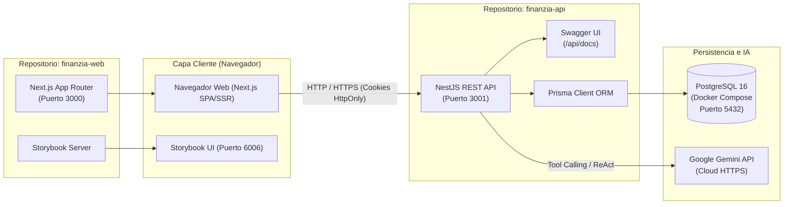
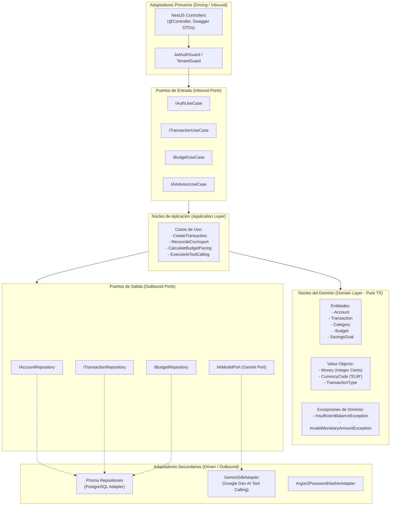
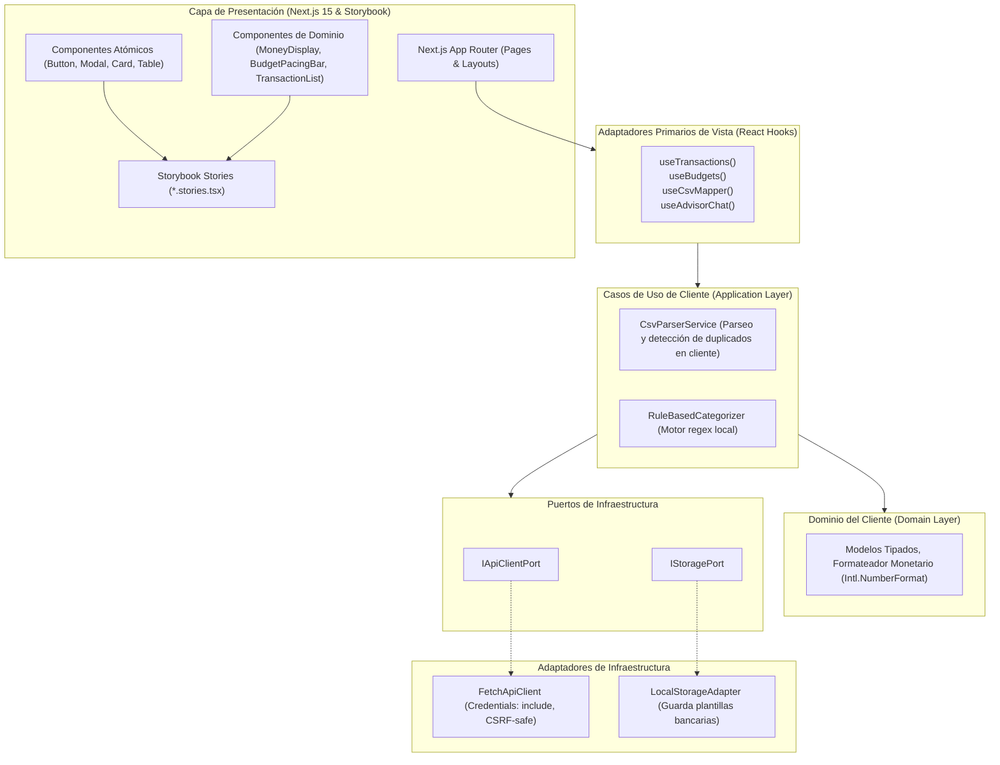
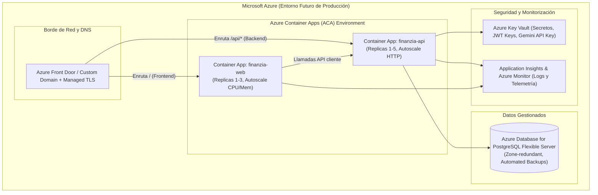

# FinanZIA — Documento de Arquitectura del Sistema

| Metadata | Detalle |
| :--- | :--- |
| **Producto** | FinanZIA (Plataforma Web de Finanzas Personales con IA) |
| **Patrón Arquitectónico** | Arquitectura Hexagonal (Puertos y Adaptadores) desacoplada en dos repositorios |
| **Repositorio Frontend** | `finanzia-web` (Next.js 15, TypeScript, Storybook, React Testing Library, Docker) |
| **Repositorio Backend** | `finanzia-api` (NestJS 10, TypeScript, Prisma, PostgreSQL 16, Swagger, Docker) |
| **Proveedor de IA** | Gemini API (Google Gen AI SDK) integrado exclusivamente en el backend |

---

## 1. Visión General y Topología de Repositorios

El sistema se estructura en dos repositorios de código completamente independientes y autónomos. Cada repositorio mantiene su propio ciclo de vida, sus dependencias, su pipeline de CI, sus herramientas de pruebas y sus manifiestos de Docker.

---

## 2. Arquitectura Hexagonal en el Backend (`finanzia-api`)

El backend implementa Arquitectura Hexagonal (Puertos y Adaptadores) para aislar las reglas de negocio financiero de la infraestructura de persistencia (Prisma) y de los frameworks de entrega (NestJS REST):

### 2.1 Principios del Backend:
1. **Independencia del Dominio**: `core/domain` no importa ningún paquete externo de NestJS ni de Prisma. Las entidades y Value Objects son clases puras de TypeScript.
2. **Representación de Dinero (`Money`)**: El Value Object `Money` garantiza que cualquier cálculo monetario se exprese en céntimos enteros (`amountInCents: number`) y valida que no existan fracciones de céntimo ni valores `NaN`.
3. **Documentación Swagger Automática**: Todos los DTOs de entrada y salida utilizan decoradores `@ApiProperty()` para generar el esquema OpenAPI 3.0 en `/api/docs`.
4. **Estrategia de Testing Backend**:
   - **Jest (Unit Tests)**: Ejecutados sobre las entidades de dominio y casos de uso con repositorios mockeados en memoria.
   - **Supertest (Integration & E2E Tests)**: Ejecutados levantando la aplicación NestJS completa con una base de datos PostgreSQL de prueba para validar transacciones SQL, migraciones y códigos de estado HTTP.

---

## 3. Arquitectura Hexagonal en el Frontend (`finanzia-web`)

El frontend traslada los principios de código limpio al cliente web desacoplando la lógica de negocio y mapeo de datos de la capa de renderizado de React:

### 3.1 Principios del Frontend:
1. **Aislamiento en Storybook**: Cada componente visual (`src/presentation/components/ui` y `financial`) se desarrolla y prueba de forma aislada en Storybook antes de integrarse en las páginas de Next.js.
2. **Testing de Frontend**:
   - **React Testing Library**: Pruebas de integración visual y accesibilidad en componentes (interacciones de usuario, modales, tablas).
   - **React Hook Testing**: Pruebas sobre la máquina de estados de los hooks (`useCsvMapper`, `useTransactions`).
   - **Playwright**: Pruebas end-to-end de los flujos críticos (registro, creación de cuenta, subida de CSV).
3. **Formateo Monetario Centralizado**: Ningún componente formatea números por su cuenta; se utiliza un componente unificado `<MoneyDisplay cents={125050} currency="EUR" />` que renderiza de manera accesible `"1.250,50 €"`.

---

## 4. Arquitectura de Infraestructura Local (Docker)

Cada repositorio cuenta con sus herramientas de contenedorización individuales:

### 4.1 Infraestructura de `finanzia-api`
- **`Dockerfile`**: Compilación multi-etapa (etapa de build con dependencias de desarrollo y etapa de producción ligera `node:20-alpine`).
- **`docker-compose.yml`**: Orquestación del backend y servicios asociados:
  - **Servicio `postgres`**: Imagen `postgres:16-alpine`, puerto `5432:5432`, volumen persistente `finanzia_pgdata`, healthcheck con `pg_isready`.
  - **Servicio `api`** (opcional para desarrollo, indispensable para pruebas reproducibles): Ejecuta la API de NestJS comunicándose por la red interna Docker.
  - **Variables de entorno**: Inyectadas desde `.env` local (no versionado en Git).

### 4.2 Infraestructura de `finanzia-web`
- **`Dockerfile`**: Compilación multi-etapa para Next.js con soporte de standalone output para optimizar peso y memoria en ejecución.
- **`docker-compose.yml`**: Permite levantar el frontend y Storybook de forma independiente si se desea ejecutar el entorno totalmente dockerizado.

---

## 5. Plan Futuro de Despliegue en Microsoft Azure (Diseño y Documentación)

Conforme a las reglas del proyecto, el despliegue en la nube **no se ejecutará** en esta fase, pero queda planificado con la siguiente topología de referencia:

*Nota: La especificación completa, dimensionamiento, cálculo de costes y checklist para Azure se entregará en el documento formal PDF en la Épica 6.*
