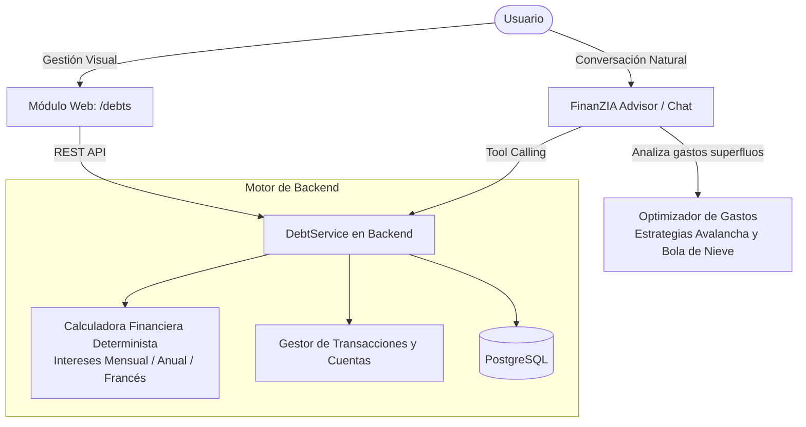
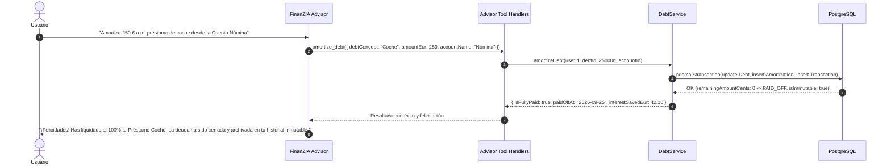

# FinanZIA — Plan de Implementación: Módulo de Manejo de Deudas y Asesoría Financiera Inteligente

| Parámetro | Detalle |
| :--- | :--- |
| **Módulo** | Gestión, Cálculo y Amortización de Deudas (`/debts`) |
| **Integraciones Clave** | Backend NestJS, Frontend Next.js, PostgreSQL + Prisma, FinanZIA Advisor (Gemini) |
| **Regla Financiera Fundamental** | **Cero Flotantes**: Todos los importes en céntimos enteros (`BigInt`) y tasas en puntos básicos (`basis points`). |
| **Regla de Ciclo de Vida** | **Inmutabilidad al 100%**: Al amortizar la totalidad de una deuda, esta pasa a un historial inmutable de solo lectura. |
| **Capacidad de IA** | Registro, consulta, amortización conversacional y optimización proactiva de gastos para amortización acelerada. |
| **Fecha de Especificación** | Septiembre 2026 |

---

## 1. Visión y Principios del Módulo

El **Módulo de Manejo de Deudas** dota a FinanZIA de la capacidad de modelar el pasivo del usuario con el mismo rigor y precisión que los activos.



### Principios Fundamentales:
1. **Paridad Total UI $\leftrightarrow$ Chat**: Toda acción realizable en la interfaz visual (crear deuda, consultar estado, amortizar capital, proyectar pagos) debe ser ejecutable mediante lenguaje natural a través de FinanZIA Advisor.
2. **Cero Flotantes (Strict Zero-Float)**: Ningún cálculo de capital o interés utiliza el tipo primitivo `float` o `double`. Los importes se gestionan en céntimos (`BigInt`) y las tasas de interés se almacenan como enteros en puntos básicos (`basis points`, donde $1\% = 100\text{ bps}$; ej. $8.75\% = 875\text{ bps}$).
3. **Inmutabilidad de Deudas Liquidadas**: Cuando una amortización reduce el saldo pendiente a 0 (`remainingAmountCents <= 0`), la deuda cambia automáticamente su estado a `PAID_OFF`, se sella con `isImmutable = true` y queda archivada en un historial protegido donde queda prohibida cualquier edición (`PUT`/`PATCH`) o eliminación (`DELETE`).
4. **Optimización Proactiva con IA**: FinanZIA Advisor examina los gastos recurrentes y presupuestos del usuario para identificar partidas no esenciales (ocio, suscripciones, restaurantes) y proponer planes concretos de amortización anticipada que ahorren intereses al usuario.

---

## 2. Modelo de Datos y Extensión de Base de Datos (Prisma)

```prisma
// ---------------------------------------------------------
// ENUMS DE DEUDAS
// ---------------------------------------------------------

enum InterestRateType {
  ANNUAL   // Tasa Anual (ej. TAE / TIN anual)
  MONTHLY  // Tasa Mensual (ej. tarjetas revolving o microcréditos)
}

enum DebtStatus {
  ACTIVE    // Deuda con saldo pendiente de amortizar
  PAID_OFF  // Amortizada al 100% (inmutable en historial)
}

// ---------------------------------------------------------
// MODELOS DE DOMINIO: DEUDAS Y AMORTIZACIONES
// ---------------------------------------------------------

/// Registro de una deuda o pasivo financiero del usuario
model Debt {
  id                         String            @id @default(uuid())
  userId                     String
  concept                    String            // Concepto (ej. "Préstamo Coche", "Tarjeta Crédito BBVA", "Hipoteca")
  creditor                   String?           // Entidad o acreedor (ej. "Banco Santander", "Cofidis", "Familiar")
  initialAmountCents         BigInt            // Importe original en céntimos (cero float)
  remainingAmountCents       BigInt            // Saldo pendiente en céntimos (cero float)
  interestRateBasisPts       Int               // Tasa de interés en puntos básicos (ej. 750 = 7.50%)
  interestRateType           InterestRateType  @default(ANNUAL)
  minimumMonthlyPaymentCents BigInt?           // Cuota mínima obligatoria o cuota fija pactada
  dueDate                    DateTime?         // Fecha límite o vencimiento final del préstamo
  status                     DebtStatus        @default(ACTIVE)
  paidOffAt                  DateTime?         // Fecha y hora exacta de amortización al 100%
  isImmutable                Boolean           @default(false) // Bloqueo estricto cuando llega a 100%
  notes                      String?           @db.Text
  createdAt                  DateTime          @default(now())
  updatedAt                  DateTime          @updatedAt

  user                       User              @relation(fields: [userId], references: [id], onDelete: Cascade)
  amortizations              DebtAmortization[]

  @@index([userId, status])
  @@map("debts")
}

/// Registro individual de un abono o amortización de deuda
model DebtAmortization {
  id                  String       @id @default(uuid())
  debtId              String
  userId              String
  accountId           String?      // Cuenta financiera local de donde salió el dinero (opcional)
  transactionId       String?      @unique // Transacción contable vinculada generada en la cuenta
  amountCents         BigInt       // Importe total abonado en céntimos
  principalCents      BigInt       // Cantidad destinada a amortizar capital
  interestCents       BigInt       // Cantidad destinada a cubrir intereses
  remainingAfterCents BigInt       // Saldo pendiente restante tras este abono
  paymentDate         DateTime     @default(now())
  notes               String?      // Notas o concepto de la amortización
  createdAt           DateTime     @default(now())

  debt                Debt         @relation(fields: [debtId], references: [id], onDelete: Cascade)
  user                User         @relation(fields: [userId], references: [id], onDelete: Cascade)
  account             Account?     @relation(fields: [accountId], references: [id], onDelete: SetNull)
  transaction         Transaction? @relation(fields: [transactionId], references: [id], onDelete: SetNull)

  @@index([debtId, paymentDate])
  @@index([userId])
  @@map("debt_amortizations")
}
```

---

## 3. Motor Matemático Financiero Determinista (Cálculo de Intereses)

### 3.1 Normalización de Tasas de Interés
* **Puntos Básicos**:
  $$\text{Tasa Decimal} = \frac{\text{basisPoints}}{10\,000}$$
  *Ejemplo*: $6.50\% \rightarrow 650\text{ bps}$.
* **Conversión de Tasa Anual a Mensual**:
  $$i_m = \frac{\text{Tasa Anual}}{12}$$
  En cálculos de alta precisión entera, se utiliza un factor de escala $10^8$:
  $$\text{monthlyFactorScaled} = \frac{\text{basisPoints} \times 10^8}{12 \times 10\,000}$$

### 3.2 Cálculo de Intereses Devengados en el Período
El interés generado por el capital vivo durante un mes se calcula como:
$$\text{interestCents} = \frac{\text{remainingAmountCents} \times \text{monthlyFactorScaled}}{10^8}$$

### 3.3 Estimación de Cuota Constante (Sistema Francés)
Para deudas con plazo fijo pactado ($n$ meses):
$$\text{Cuota} = \text{Capital} \times \frac{i \cdot (1+i)^n}{(1+i)^n - 1}$$
Si el usuario no especifica plazo, la cuota mensual se deriva del `minimumMonthlyPaymentCents` configurado o de la suma de amortización de capital deseada más los intereses del mes.

### 3.4 Desglose de la Amortización
Cuando el usuario amortiza un importe total $A$:
1. $\text{interestCents} = \min(A, \text{intereses devengados pendientes})$
2. $\text{principalCents} = A - \text{interestCents}$
3. $\text{newRemainingCents} = \max(0, \text{remainingAmountCents} - \text{principalCents})$
4. **Regla del 100%**: Si $\text{newRemainingCents} == 0$, el estado se actualiza a `PAID_OFF`, se asigna `isImmutable = true` y `paidOffAt = now()`.

---

## 4. Diseño de Endpoints de la API Backend (`finanzia-api`)

| Método | Endpoint | Descripción | Comportamiento Clave |
| :--- | :--- | :--- | :--- |
| `POST` | `/api/debts` | Da de alta una nueva deuda | Convierte importes a céntimos y tasa a bps. |
| `GET` | `/api/debts` | Lista deudas activas (`status: ACTIVE`) | Incluye métricas agregadas (total pasivo, cuota mensual global). |
| `GET` | `/api/debts/history` | Historial de deudas liquidadas (`PAID_OFF`) | Solo lectura. Incluye fecha de liquidación e intereses totales pagados. |
| `GET` | `/api/debts/:id` | Detalle de deuda y su cronograma | Lista todas las amortizaciones realizadas y proyección restante. |
| `PATCH` | `/api/debts/:id` | Modifica datos de una deuda activa | **Bloqueo 403 Forbidden** si `isImmutable === true`. |
| `DELETE` | `/api/debts/:id` | Elimina una deuda activa | **Bloqueo 403 Forbidden** si `isImmutable === true`. |
| `POST` | `/api/debts/:id/amortize` | Registra una amortización (parcial o total) | Transaccional: actualiza deuda, genera apunte contable opcional y sella si llega a 0. |
| `POST` | `/api/debts/simulate` | Simulación de amortización acelerada | Proyecta método Avalancha vs Bola de Nieve y ahorro en meses e intereses. |

---

## 5. Integración con FinanZIA Advisor (Herramientas Gemini y Lógica Local)



### Herramientas Function Calling Registradas:
1. **`create_debt`**:
   * *Parámetros*: `concept`, `amountEur`, `interestRatePercent`, `interestRateType` (`ANNUAL` | `MONTHLY`), `creditor?`, `minimumMonthlyPaymentEur?`, `dueDate?`.
   * *Función*: Crea la deuda traduciendo automáticamente euros a céntimos y porcentaje a puntos básicos.
2. **`get_debts`**:
   * *Parámetros*: `includePaidOff` (boolean, por defecto `false`).
   * *Función*: Devuelve las deudas activas o el historial liquidado con sus saldos y costes mensuales de intereses.
3. **`amortize_debt`**:
   * *Parámetros*: `debtId` o `conceptKeyword`, `amountEur`, `fromAccountName?`, `notes?`.
   * *Función*: Ejecuta la amortización, deduce el saldo de la cuenta bancaria si se especificó, calcula el nuevo saldo y verifica si se alcanzó el 100%.
4. **`simulate_debt_payoff`**:
   * *Parámetros*: `extraMonthlyBudgetEur`, `strategy` (`AVALANCHE` | `SNOWBALL`).
   * *Función*: Simula la aceleración de pagos comparando intereses totales y tiempo para estar 100% libre de deudas.
5. **`analyze_debt_optimization`**:
   * *Función*: Examina los gastos en categorías prescindibles (ocio, restauración, compras impulsivas) del último trimestre. Detecta partidas donde se puedan recortar, por ejemplo, 120 €/mes y calcula el impacto directo: *"Si reduces un 25% tu gasto en Restaurantes, podrías liquidar tu Tarjeta BBVA 5 meses antes y ahorrar 184 € en intereses"*.

---

## 6. Diseño de la Interfaz de Usuario (`finanzia-web`)

Se crea la vista principal `/debts` integrada en el menú de navegación con tabs:
1. **Deudas Activas**: Visualización de deudas vivas, barras de progreso, desglose de capital e intereses devengados, y botón directo `[Amortizar]`.
2. **Historial Liquidado (Inmutable)**: Vista protegida con distintivo "100% Pagada", fecha de finiquito y bloqueo de operaciones.
3. **Simulador de Amortización Acelerada**: Control deslizante de ahorro extra para comparar ahorros en intereses mediante método Avalancha vs. Bola de Nieve.

---

## 7. Roadmap de Implementación por Fases

### Fase 1: Dominio y Esquema de Datos
1. Actualización de [schema.prisma](file:///e:/personal-finance/finanzia-api/prisma/schema.prisma) con `Debt` y `DebtAmortization`.
2. Migración local con `npx prisma db push`.
3. Implementación del servicio de dominio `DebtInterestCalculator` en `finanzia-api` con cobertura de pruebas unitarias sobre tasas mensuales, anuales y cuota constante sin usar flotantes.

### Fase 2: Backend Core y Transaccionalidad
1. Creación del módulo `DebtsModule` en `finanzia-api`.
2. Implementación de los casos de uso:
   * `CreateDebtUseCase`
   * `GetActiveDebtsUseCase` y `GetDebtHistoryUseCase`
   * `AmortizeDebtUseCase`: Ejecución de transacción atómica que descuenta saldo de la cuenta bancaria, reduce el capital vivo de la deuda y, si el saldo llega a 0, sella la deuda con `isImmutable = true`.
   * `SimulatePayoffUseCase`: Simulación determinista comparativa (Avalancha vs Bola de nieve).
3. Guardas de control para devolver `403 Forbidden` ante cualquier intento de alteración de registros inmutables.

### Fase 3: FinanZIA Advisor con Asesoría de Deudas
1. Registro de las herramientas `create_debt`, `get_debts`, `amortize_debt`, `simulate_debt_payoff` y `analyze_debt_optimization` en [gemini-advisor.service.ts](file:///e:/personal-finance/finanzia-api/src/infrastructure/ai/gemini-advisor.service.ts).
2. Implementación del razonador de optimización: la IA examina el historial de transacciones y presupuestos del usuario para recomendar recortes concretos en gastos prescindibles.
3. Generación de recomendaciones interactivas con botones de acción `[Aprobar y Amortizar]` en el chat.

### Fase 4: Frontend Web (`finanzia-web`)
1. Creación de componentes modulares en Storybook: `DebtCard`, `AmortizeDebtModal`, `CreateDebtModal`, `DebtHistoryTable`.
2. Implementación de la ruta `/debts` con diseño premium, pestañas de navegación y gráficos de progreso.
3. Conexión del widget interactivo de simulación de amortización.

### Fase 5: QA y Validación Integral
1. Tests unitarios de cálculo de intereses (mensual/anual) sin coma flotante.
2. Pruebas de inmutabilidad: verificación de rechazo `403` al intentar alterar deudas al 100%.
3. Pruebas conversacionales con FinanZIA Advisor en lenguaje natural.
