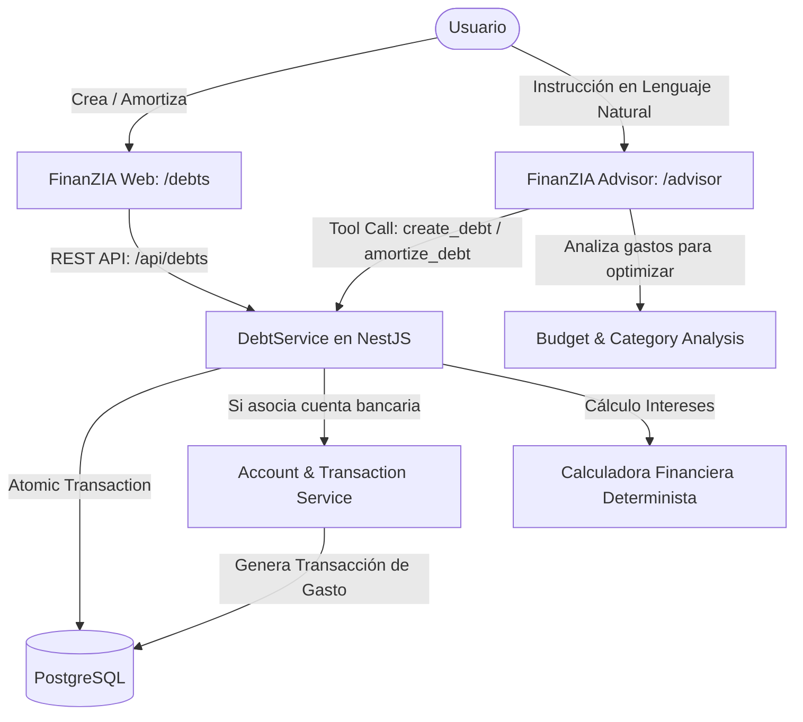

# FinanZIA — Épica 7: Gestión, Cálculo y Amortización de Deudas con Asesoría IA

| Metadata | Detalle |
| :--- | :--- |
| **Identificador** | **ÉPICA-07** |
| **Nombre** | Gestión, Cálculo y Amortización de Deudas (Debt Management Module) |
| **Módulo** | Módulo de Deudas (`/debts` en web, `/api/debts` en backend) |
| **Integraciones Clave** | FinanZIA Advisor (Gemini Function Calling), Motor Contable de Transacciones, Presupuestos |
| **Regla Financiera Crítica** | **Cero Flotantes**: Todos los importes en céntimos de euro (`BigInt`) y tasas en puntos básicos (`basis points`). |
| **Estado Actual** | **Especificado y Listo para Planificación / Desarrollo** |
| **Documento de Referencia Técnica** | [`docs/debt-management-implementation-plan.md`](./debt-management-implementation-plan.md) |

---

## 1. Resumen y Propósito de la Épica

El módulo de **Gestión de Deudas** permite a los usuarios registrar, supervisar y amortizar sus pasivos financieros (préstamos personales, hipotecas, líneas de crédito, saldos de tarjetas de crédito o deudas a terceros) de forma transparente y controlada.

La funcionalidad cuenta con integración bidireccional entre la interfaz visual (`/debts`) y el **Asistente FinanZIA AI**:
1. El usuario puede registrar y amortizar deudas tanto desde la interfaz gráfica como conversando en lenguaje natural con la IA.
2. El sistema calcula de forma determinista el devengo de intereses (mensuales o anuales) y las cuotas de amortización.
3. Al alcanzar el **100% de amortización**, la deuda se liquida, se archiva de manera **inmutable** en el historial (impidiendo cualquier modificación o borrado accidental posterior) y se actualiza el patrimonio neto del usuario.
4. **FinanZIA Advisor** actúa como consultor proactivo analizando los presupuestos y gastos prescindibles del usuario para proponer planes de ahorro dedicados a amortizar deuda anticipadamente mediante métodos de optimización financiera (Avalancha y Bola de Nieve).

---

## 2. Historias de Usuario (User Stories)

### HU-23: Alta y Consulta de Deudas desde UI y Asistente IA
* **Como** usuario de FinanZIA,
* **quiero** dar de alta mis deudas indicando concepto, importe pendiente, tipo y tasa de interés (mensual o anual) y plazo, ya sea rellenando un formulario en `/debts` o pidiéndoselo a FinanZIA Advisor en el chat,
* **para** tener una visión centralizada y consolidada de todos mis pasivos financieros.

### HU-24: Motor Determinista de Cálculo de Intereses y Cuotas
* **Como** usuario con deudas a tipo mensual o anual,
* **quiero** que la aplicación calcule automáticamente los intereses devengados por período y la cuota estimada,
* **para** conocer con exactitud el coste financiero real de cada deuda sin depender de hojas de cálculo externas.

### HU-25: Amortización Parcial de Deudas (UI y Chat IA)
* **Como** usuario,
* **quiero** registrar pagos o amortizaciones extraordinarias a una deuda (indicando fecha, importe y opcionalmente la cuenta bancaria de origen de los fondos), tanto desde la web como diciéndole a la IA *"amortiza 300 € de mi préstamo de coche"*,
* **para** reducir mi saldo pendiente y que se genere automáticamente el apunte contable en mis cuentas.

### HU-26: Liquidación al 100% e Historial Inmutable
* **Como** usuario,
* **quiero** que cuando una deuda quede amortizada al 100%, se retire de la lista de deudas activas y quede archivada en un historial protegido contra modificaciones o eliminaciones,
* **para** celebrar la liquidación de mi pasivo y conservar un registro histórico auditable de mis pagos.

### HU-27: Asesoría IA de Optimización de Gastos para Amortización
* **Como** usuario que busca liberarse de sus deudas más rápido,
* **quiero** que FinanZIA Advisor analice mis presupuestos mensuales y patrones de gasto discrecional para sugerirme recortes realistas destinados a amortizar deuda,
* **para** redirigir dinero no esencial hacia la reducción de mis intereses financieros.

### HU-28: Simulación de Estrategias de Liquidación (Avalancha vs. Bola de Nieve)
* **Como** usuario con múltiples deudas,
* **quiero** simular escenarios de amortización comparando la estrategia Avalancha (mayor interés primero) frente a Bola de Nieve (menor saldo primero),
* **para** decidir cuál es el método más eficiente o motivador según mi situación personal.

---

## 3. Criterios de Aceptación y Calidad (QA)

| Código | Criterio de Verificación | Severidad |
| :--- | :--- | :--- |
| **CA-07.1** | **Integridad Monetaria**: Montos iniciales, amortizaciones y saldos pendientes se gestionan exclusivamente en céntimos (`BigInt`). Queda prohibido el uso de flotantes para importes. | **Bloqueante** |
| **CA-07.2** | **Precisión de Tasas de Interés**: Las tasas se representan en puntos básicos enteros (`interestRateBasisPts`, ej. 7,25% anual = 725 bps). Las conversiones de tasa mensual/anual siguen fórmulas matemáticas estandarizadas sin pérdida de precisión. | **Bloqueante** |
| **CA-07.3** | **Bloqueo Inmutable al 100%**: Cuando `remainingAmountCents == 0`, el estado cambia a `PAID_OFF` y `isImmutable = true`. Cualquier petición `PUT`, `PATCH` o `DELETE` sobre una deuda inmutable devuelve `403 Forbidden` ("Las deudas liquidadas al 100% forman parte del historial inmutable"). | **Bloqueante** |
| **CA-07.4** | **Transaccionalidad en Amortizaciones**: Si el usuario amortiza vinculando una cuenta bancaria local, la reducción de saldo de la cuenta y el decremento del saldo de la deuda se ejecutan en una transacción atómica de base de datos (`prisma.$transaction`). | **Bloqueante** |
| **CA-07.5** | **Paridad Funcional con FinanZIA Advisor**: FinanZIA Advisor cuenta con las herramientas `create_debt`, `get_debts`, `amortize_debt` y `simulate_debt_payoff`. El usuario puede ejecutar cualquier operación por chat con exactamente el mismo resultado que en la interfaz visual. | **Alta** |
| **CA-07.6** | **Cero Alucinaciones en Cálculos de IA**: En las recomendaciones de amortización, la IA no inventa intereses ni plazos; los cálculos proceden del motor determinista del backend. | **Bloqueante** |
| **CA-07.7** | **Aislamiento Multi-inquilino**: Las consultas y mutaciones de deudas validan estrictamente el `userId` extraído del token JWT verificado. | **Bloqueante** |

---

## 4. Dependencias y Relaciones del Sistema

