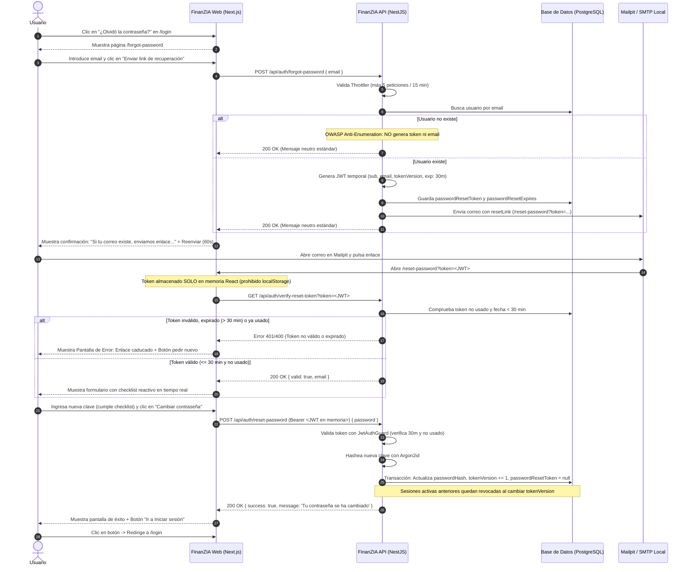

# FinanZIA — Épica: Recuperación de Contraseña y Restablecimiento Seguro de Acceso

| Metadata | Detalle |
| :--- | :--- |
| **Identificador** | **ÉPICA-AUTH-002** |
| **Nombre** | Recuperación de Contraseña y Restablecimiento Seguro (Password Recovery & Reset Flow) |
| **Módulo** | Módulo de Autenticación e Identidad (`(auth)/forgot-password`, `(auth)/reset-password` en web, `/api/auth` en backend) |
| **Integraciones Clave** | `AuthService`, `JwtService`, `IEmailPort` (`NodemailerEmailAdapter` / Mailpit), `PrismaUserRepository`, `@nestjs/throttler` |
| **Metodología** | **TDD Estricto** (Red ➔ Green ➔ Refactor) en todas las capas del backend y frontend |
| **Ventana de Seguridad** | Token JWT de **un solo uso** con caducidad estricta de **30 minutos** |
| **Protección OWASP** | Respuesta neutra anti-enumeración de usuarios + Rate Limiting |
| **Revocación de Sesiones** | Invalidación inmediata de todas las sesiones activas previas mediante versionado de tokens (`tokenVersion`) |
| **Almacenamiento en Cliente** | Token temporal retenido **estrictamente en memoria de React** (prohibido `localStorage`) |
| **Quality Gates** | Aprobación al 100% de `npm test`, `npm run lint:arch` (Dependency Cruiser) y `npm run lint` |
| **Estado Actual** | **Listo para Implementación — Pendiente de Aprobación Humana** |
| **Documento de Planificación** | [`docs/password-recovery-implementation-plan.md`](./password-recovery-implementation-plan.md) |

---

## 1. Resumen Ejecutivo y Objetivos

### 1.1. Contexto
En una aplicación de gestión patrimonial y finanzas personales como **FinanZIA**, el acceso ininterrumpido y seguro es crítico. Si un usuario olvida su contraseña, debe disponer de un mecanismo de autoservicio que le permita recuperarla de forma intuitiva, inmediata y con las máximas garantías de seguridad criptográfica, adoptando los estándares recomendados por **OWASP ASVS** para flujos de restablecimiento de credenciales.

### 1.2. Objetivos Principales
1. **Desarrollo Guiado por Pruebas (TDD)**: Construcción de cada componente escribiendo primero pruebas unitarias que fallen antes de implementar el código de producción.
2. **Respeto a la Arquitectura Hexagonal**: Separación limpia entre Dominio, Aplicación, Infraestructura y Presentación, validada mediante `dependency-cruiser`.
3. **Defensa contra Enumeración de Cuentas (OWASP)**: El endpoint de solicitud siempre devuelve una respuesta neutra y consistente, evitando que un atacante descubra qué correos están registrados en la plataforma.
4. **Seguridad Robusta con Ventana Temporal de 30 Minutos y Un Solo Uso**: El enlace generado incorpora un token temporal verifiable que expira a los 30 minutos de su creación y queda invalidado inmediatamente tras su primer uso exitoso.
5. **Protección contra Fuerza Bruta y Spam (Rate Limiting)**: Control estricto de tasa mediante `@nestjs/throttler` (máximo 3 a 5 peticiones cada 15 minutos por IP y correo) sumado a cooldown en la interfaz.
6. **Revocación Integral de Sesiones Activas**: Al cambiar la contraseña, cualquier sesión abierta previamente en cualquier navegador queda automáticamente revocada mediante incremento de `tokenVersion`.
7. **Aislamiento en Memoria**: El token temporal nunca se persiste en `localStorage` o cookies persistentes, manteniéndose exclusivamente en memoria de React durante la interacción.
8. **Consistencia de Criterios Criptográficos**: La nueva contraseña debe cumplir con los mismos estándares de robustez exigidos durante el registro (longitud 8-72, mayúscula, número, símbolo especial) y ser cifrada mediante **Argon2id**.

---

## 2. Alcance (Scope)

### ✅ En Alcance (In Scope)
* **Metodología y Arquitectura**:
  * Implementación mediante ciclo TDD: tests unitarios en Jest previos a cada desarrollo.
  * Preservación estricta de la Arquitectura Hexagonal en `finanzia-api` (cero violaciones en `dependency-cruiser`).
  * Validación final obligatoria con `npm test`, `npm run lint:arch` y `npm run lint`.
* **Pantalla de Inicio de Sesión (`/login`)**:
  * Inclusión del enlace interactivo "¿Olvidó la contraseña?" con redirección a `/forgot-password`.
* **Página de Solicitud de Recuperación (`/forgot-password`)**:
  * Campo de entrada para correo electrónico con validación de formato.
  * Botón primario "Enviar link de recuperación".
  * Botón secundario "Atrás" con retorno seguro a `/login`.
  * Estados de carga y deshabilitación durante peticiones.
* **Página de Confirmación de Envío (`/forgot-password` estado enviado)**:
  * Mensaje neutro OWASP informando: *"Si tu correo electrónico coincide con una cuenta registrada, te hemos enviado un enlace de recuperación"*.
  * Instrucciones explícitas de revisar la bandeja de entrada y la carpeta de **spam** / correo no deseado.
  * Botón interactivo de "Reenviar link" (con temporizador de cooldown anti-spam de 60 segundos).
  * Enlace directo a la interfaz web de Mailpit (`localhost:8025`) en entorno de desarrollo local.
* **Página de Verificación de Enlace y Nueva Contraseña (`/reset-password?token=...`)**:
  * Verificación proactiva del token en el backend al abrir el enlace.
  * **Si el enlace es inválido, ha caducado (> 30 minutos) o ya fue utilizado**: Pantalla de error amigable con explicación clara y opciones ("Solicitar nuevo enlace" y "Volver al login").
  * **Si el enlace es válido (<= 30 minutos y no usado)**: Despliegue del formulario de restablecimiento.
  * Campos: "Nueva contraseña" y "Repetir nueva contraseña" con visibilidad alternable.
  * Checklist reactivo en tiempo real de los criterios de registro: 8 a 72 caracteres, 1 mayúscula, 1 número y 1 carácter especial, además de coincidencia estricta.
  * Botón de acción "Cambiar contraseña" (deshabilitado hasta cumplir todas las condiciones).
  * El token se maneja **exclusivamente en memoria de React** (prohibido `localStorage`).
* **Página de Confirmación de Éxito**:
  * Mensaje "Tu contraseña se ha cambiado" / "¡Contraseña actualizada con éxito!".
  * Botón prominente de redirección al inicio de sesión (`/login`).
* **Backend y Seguridad (`finanzia-api`)**:
  * Anti-enumeración OWASP: respuesta neutra 200 indistintamente de la existencia de la cuenta.
  * Rate Limiting: limitador con `@nestjs/throttler` (máx. 5 peticiones cada 15 min).
  * Token de Un Solo Uso: almacenamiento de token en `User` y limpieza inmediata tras el reseteo.
  * Revocación de Sesiones: campo `tokenVersion` en `User` incrementado al resetear contraseña; `JwtStrategy` valida concordancia con el payload.
  * Endpoint Protegido: `POST /auth/reset-password` protegido por `JwtAuthGuard` mediante Bearer token.
  * Hasheo seguro con Argon2id.

### ❌ Fuera de Alcance (Out of Scope)
* Preguntas de seguridad o autenticación secundaria por SMS / TOTP (se planificarán en una épica posterior de 2FA).
* Recuperación mediante enlace mágico de un solo uso sin contraseña (passwordless login).

---

## 3. Diagrama de Flujo del Usuario (User Flow)

---

## 4. Criterios de Aceptación y Calidad (QA)

| Código | Criterio de Verificación | Severidad |
| :--- | :--- | :--- |
| **CA-AUTH-01** | **Presencia y Destino del Link en Login**: El enlace "¿Olvidó la contraseña?" se muestra accesible en `/login`, dirigiendo a `/forgot-password`. | **Bloqueante** |
| **CA-AUTH-02** | **Navegación de Retorno**: El botón "Atrás" en `/forgot-password` retorna a `/login` sin pérdida indebida de contexto. | **Alta** |
| **CA-AUTH-03** | **Anti-Enumeración OWASP**: `POST /auth/forgot-password` responde siempre HTTP 200 con mensaje neutro indistintamente de si el email existe o no en base de datos. | **Bloqueante** |
| **CA-AUTH-04** | **Rate Limiting**: El endpoint `POST /auth/forgot-password` bloquea con `429 Too Many Requests` tras superar 5 solicitudes en una ventana de 15 minutos por IP. | **Bloqueante** |
| **CA-AUTH-05** | **Caducidad Estricta de 30 Minutos**: El token temporal expira a los 30 minutos (`expiresIn: '30m'`). Pasados 30 minutos, el enlace es rechazado. | **Bloqueante** |
| **CA-AUTH-06** | **Token de Un Solo Uso**: Tras actualizar la contraseña exitosamente, el token queda invalidado en base de datos (`passwordResetToken = null`). Cualquier intento posterior de reutilización devuelve error. | **Bloqueante** |
| **CA-AUTH-07** | **Revocación de Sesiones Activas**: Al completar el cambio de clave, se incrementa `tokenVersion` en `User`, lo que invalida de forma inmediata todos los JWTs de sesión emitidos previamente. | **Bloqueante** |
| **CA-AUTH-08** | **Token Exclusivo en Memoria**: El frontend no almacena el token de reseteo en `localStorage` ni en cookies de cliente; reside exclusivamente en el estado React del formulario. | **Bloqueante** |
| **CA-AUTH-09** | **Checklist Reactivo de Contraseña**: El formulario muestra retroalimentación visual interactiva en tiempo real sobre los 5 requisitos (8-72 caracteres, mayúscula, número, carácter especial y coincidencia) deshabilitando el botón hasta su cumplimiento. | **Alta** |
| **CA-AUTH-10** | **Protección por Token en Mutación**: `POST /auth/reset-password` requiere el token en el header `Authorization: Bearer <token>`; llamadas sin token retornan `401 Unauthorized`. | **Bloqueante** |
| **CA-AUTH-11** | **Hasheo Seguro con Argon2id**: La nueva contraseña se almacena exclusivamente como hash generado con Argon2id. | **Bloqueante** |
| **CA-AUTH-12** | **Pantalla de Éxito y Redirección**: Tras la mutación, se muestra la vista "Tu contraseña se ha cambiado" con botón que redirige a `/login`. | **Alta** |
| **CA-AUTH-13** | **TDD y Cobertura de Tests**: Toda la lógica cuenta con tests unitarios desarrollados previamente, alcanzando el 100% de paso en `npm test`. | **Bloqueante** |
| **CA-AUTH-14** | **Cero Violaciones de Arquitectura**: El comando `npm run lint:arch` (Dependency Cruiser) y `npm run lint` deben finalizar con 0 errores y 0 advertencias. | **Bloqueante** |
