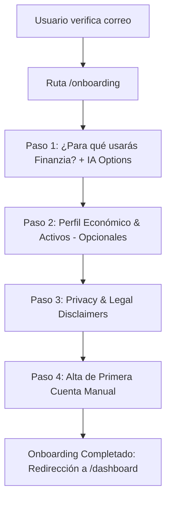

# ÉPICA: Módulo de Perfil de Usuario y Onboarding Inicial Guiado (Wizard)

**Identificador:** `EPIC-PROF-001`  
**Estado:** `Ready for Implementation`  
**Prioridad:** `Alta`  
**Área:** `Core / Identity / Onboarding / AI Experience`  
**Fecha:** `2026-09-29`  
**Target Applications:** `finanzia-api` (Backend) / `finanzia-web` (Frontend Next.js)

---

## 1. Resumen Ejecutivo y Objetivos

### 1.1. Contexto
Tras registrarse y verificar su correo electrónico con éxito, el usuario necesita una experiencia de bienvenida que capture información clave para personalizar su experiencia financiera y calibrar el comportamiento del **Agente Asesor de IA (AI Advisor)**, manteniendo estándares estrictos de privacidad y cumplimiento legal. Asimismo, el usuario debe tener control total para consultar y actualizar estos datos en cualquier momento dentro de la plataforma a través de un módulo centralizado de **Perfil**.

### 1.2. Objetivos Principales
1. **Reducir la fricción inicial**: Guiar al usuario paso a paso (Wizard interactivo) tras la verificación de correo sin abrumarlo con campos innecesarios.
2. **Personalización del Agente IA y del Dashboard**: Capturar objetivos de uso y perfil económico básico para que el agente de IA ofrezca análisis y resúmenes contextualmente pertinentes.
3. **Cumplimiento Legal y Transparencia (Privacy First)**: Comunicar con total claridad el alcance de la aplicación (no custodia bancaria, no recomendaciones financieras reguladas, no publicidad, modelo read-only manual).
4. **Activación de Producto (Time to Value)**: Permitir al usuario crear su primera cuenta manual inmediatamente al final del wizard para que ingrese al dashboard con valor tangible desde el día cero.
5. **Autonomía y Control**: Permitir ver y editar estos datos de manera organizada en una sección dedicada `/profile` dentro de la app.

---

## 2. Alcance (Scope)

### ✅ En Alcance (In Scope)
* **Parte 1: Wizard de Onboarding Inicial (4 Pasos)**:
  * **Paso 1: Intención y Objetivos de Uso**: Selección de propósitos con opciones estándar, dinámicas orientadas a la interacción con el Agente de IA, y opción "Otros" con campo de texto libre.
  * **Paso 2: Perfil Económico y Financiero**: Profesión/oficio, rango o monto de salario bruto anual, radios Sí/No para tenencia de activos (real estate generador de rentas, inversiones en bolsa, criptomonedas/activos digitales), más campos opcionales recomendados (moneda de preferencia, horizonte temporal/conocimiento financiero).
  * **Paso 3: Disclaimer Legal y Compromiso de Privacidad**: Declaración formal y amigable de lo que la app **NO hace** (no guarda credenciales bancarias, sin anuncios, privacidad estricta, no pagos ni transacciones monetarias, no asesoramiento de inversión regulado según la ley vigente).
  * **Paso 4: Creación de la Primera Cuenta Manual**: Formulario directo para dar de alta la primera cuenta financiera (ej. Efectivo, Cuenta Nómina, Ahorros, etc.) sin conexiones bancarias automatizadas.
* **Parte 2: Módulo de Perfil dentro de la Aplicación (`/profile`)**:
  * Visualización y edición en tiempo real de los datos recogidos en el onboarding y registro.
  * Agrupación por pestañas o secciones: Datos Personales, Objetivos y Preferencias Financieras, Perfil Económico y Patrimonial, Declaraciones Legales y Privacidad.
  * Restricción de scope: No solicitar campos nuevos fuera de los establecidos en el registro y wizard.
* **Backend y Persistencia**:
  * Esquema Prisma con modelos `UserProfile`, `UserFinancialProfile` y estado del onboarding (`onboardingCompleted`).
  * Endpoints RESTful protegidos por JWT con validación estricta de DTOs.
  * Guardias de navegación (Route Guards) en frontend que impidan acceder al dashboard si no se ha completado el wizard, y viceversa.

### ❌ Fuera de Alcance (Out of Scope)
* Conexiones automáticas mediante Open Banking / agregadores bancarios (Plaid, Tink, etc.).
* Modificación de correo electrónico o flujos de cambio de contraseña (gestionados por el módulo de autenticación existente).
* Ejecución o recomendación de compras/ventas de activos.
* Procesamiento de cobros o pasarelas de pago.

---

## 3. Desglose Detallado de Requisitos Funcionales

### PARTE 1: Onboarding Wizard (Post-Verificación de Email)



#### Paso 1: Intención y Objetivos de Uso
* **Título**: *"¿Cómo te gustaría que Finanzia transforme tus finanzas?"*
* **Subtítulo**: *"Selecciona una o varias opciones para que nuestra plataforma y tu Asistente IA personalicen tu experiencia."*
* **Tipo de selección**: Casillas de verificación múltiples (Checkboxes / Multi-select Cards).
* **Opciones estándar requeridas**:
  1. *Mantener control de mis ingresos y gastos*
  2. *Ver todas mis finanzas en un solo lugar*
  3. *Manejar y planificar mis presupuestos mensuales*
  4. *Crear y monitorear metas de ahorro concretas*
  5. *Diseñar un plan para pagar mis deudas*
  6. *Recibir ayuda para planificar mis finanzas personales*
* **Opciones orientadas al Agente de IA (Propuestas de Valor)**:
  7. 🤖 *Optimizar mis gastos automáticamente con sugerencias inteligentes del Asistente IA*
  8. 💬 *Interactuar en lenguaje natural con mi Asistente Financiero para resolver dudas de mi dinero*
  9. 📊 *Recibir alertas proactivas y resúmenes inteligentes sobre anomalías en mis consumos*
  10. 🎯 *Aprender mejores hábitos financieros con explicaciones guiadas paso a paso*
* **Opción "Otros"**:
  11. *Otros motivos* (Al marcarse, despliega un `textarea` o `input` accesible con placeholder: *"Cuéntanos brevemente qué te gustaría lograr..."*, límite 250 caracteres).
* **Validación**: Al menos 1 opción debe ser seleccionada para habilitar el botón "Siguiente".

---

#### Paso 2: Perfil Económico y Financiero
* **Título**: *"Tu contexto financiero"*
* **Subtítulo**: *"Esta información es opcional y confidencial. Nos permite calibrar los análisis y métricas relevantes para tu situación."*
* **Campos principales**:
  1. **Profesión u Oficio**:
     * Tipo: Input de texto o selector categorizado con opción libre (ej. *Ingeniería / Tecnología, Salud, Docencia, Emprendimiento / Negocio propio, Creativo / Diseño, Oficios independientes, Estudiante, Otro*).
     * Obligatorio: **No**.
  2. **Salario / Ingresos Brutos Anuales**:
     * Tipo: Selector de rangos de ingresos o input numérico opcional (rangos recomendados para mayor privacidad: *Menos de 15.000 €, 15.000 € - 30.000 €, 30.000 € - 50.000 €, 50.000 € - 80.000 €, Más de 80.000 €, Prefiero no responder*).
     * Obligatorio: **No**.
  3. **Activos generadores de ingresos (Real Estate / Inmuebles)**:
     * Pregunta: *"¿Cuentas con bienes inmuebles o propiedades que te generen ingresos pasivos o alquileres?"*
     * Tipo: Radio buttons `[ Sí ]` / `[ No ]`.
     * Obligatorio: **No**.
  4. **Inversiones en Bolsa y Mercados Financieros**:
     * Pregunta: *"¿Inviertes actualmente en acciones, ETFs, fondos indexados o bonos?"*
     * Tipo: Radio buttons `[ Sí ]` / `[ No ]`.
     * Obligatorio: **No**.
  5. **Inversiones en Criptomonedas / Activos Digitales**:
     * Pregunta: *"¿Posees inversiones en activos digitales o criptomonedas (Bitcoin, Ethereum, etc.)?"*
     * Tipo: Radio buttons `[ Sí ]` / `[ No ]`.
     * Obligatorio: **No**.
* **Información adicional sugerida (Campos de alto valor para el perfil)**:
  6. **Moneda Base Principal**:
     * Selector desplegable: *EUR (€), USD ($), GBP (£), etc.* (Crucial para visualización uniforme de balances y presupuestos).
  7. **Fondo de Emergencia actual**:
     * Radios / Chips: *Aún no tengo / Menos de 3 meses de gastos / Entre 3 y 6 meses / Más de 6 meses*.
  8. **Nivel de Conocimiento Financiero**:
     * Radios / Chips: *Principiante (quiero explicaciones sencillas) / Intermedio / Avanzado*. (Permite al Agente de IA modular su vocabulario técnico).
* **Navegación**: Botón *"Omitir este paso"* o *"Siguiente"* habilitado en todo momento.

---

#### Paso 3: Disclaimer Legal y Compromiso de Privacidad
* **Título**: *"Lo que Finanzia es, y lo que NUNCA será"*
* **Subtítulo**: *"Nuestra prioridad absoluta es tu privacidad y la transparencia total contigo."*
* **Estructura de Bloques Informativos**:
  1. 🛡️ **Cero Datos Bancarios Sensibles ni Credenciales**:
     * *"Finanzia nunca solicitará, almacenará ni tendrá acceso a tus contraseñas bancarias, números de tarjeta de crédito, PINs ni claves de acceso a tus entidades financieras."*
  2. 🔒 **100% Privacidad, Cero Anuncios (Zero Ads)**:
     * *"Tus datos son tuyos. No vendemos tu información a terceros, no emitimos publicidad segmentada ni monetizamos tus hábitos de consumo."*
  3. 👁️ **Modo Lectura y Gestión Manual (Sin Transacciones Monetarias)**:
     * *"La aplicación opera en modalidad estrictamente analítica e informativa. Desde Finanzia no se pueden realizar transferencias de dinero, pagos, cobros ni movimientos de capital entre cuentas."*
  4. ⚖️ **No Asesoramiento Financiero Regulado (Aviso Legal & Compliance)**:
     * *"De acuerdo con la legislación vigente, Finanzia y su Asistente de Inteligencia Artificial proporcionan herramientas analíticas, simulaciones y apoyo organizativo con fines puramente educativos e informativos. En ningún caso constituyen recomendaciones de inversión personalizadas, asesoramiento financiero oficial ni incitación a la contratación de productos específicos."*
* **Acción del usuario**:
  * Checkbox interactivo: `[x] He leído y comprendo los principios de privacidad, el modelo manual y las limitaciones legales del servicio.`
  * Botón *"Continuar a crear mi cuenta"* (se habilita al marcar el checkbox).

---

#### Paso 4: Creación de la Primera Cuenta Financiera (Modo Manual)
* **Título**: *"Crea tu primera cuenta"*
* **Subtítulo**: *"Para empezar a organizar tus finanzas, registra tu primera cuenta o fondo de dinero. No requiere conexión a ningún banco."*
* **Campos del formulario**:
  1. **Nombre de la cuenta** (Ej. *"Cuenta Corriente Principal"*, *"Efectivo en mano"*, *"Ahorros BBVA"*, *"Billetera Personal"*). `Input text - Requerido`.
  2. **Tipo de cuenta**:
     * Opciones: `Checking / Corriente`, `Savings / Ahorros`, `Cash / Efectivo`, `Investment / Inversión`, `Credit Card / Tarjeta`, `Other / Otra`. `Select / Dropdown - Requerido`.
  3. **Moneda**:
     * Por defecto la elegida en el paso anterior o predeterminada del sistema (ej. `EUR`). `Requerido`.
  4. **Saldo Inicial (Balance Inicial)**:
     * Valor numérico con formato de moneda. Permite balance `0.00`. `Requerido`.
  5. **Color o Icono identificador (Opcional)**:
     * Selector de badge o color para fácil identificación visual.
* **Acción de finalización**:
  * Botón *"Finalizar configuración y entrar a mi Dashboard"*.
  * Ejecuta la transacción de creación de cuenta + actualización de `onboardingCompleted: true` en el backend.
  * Dispara feedback visual (confetti sutil o toast de éxito) y redirige a `/dashboard`.

---

### PARTE 2: Módulo de Perfil dentro de la Aplicación (`/profile`)

Una vez dentro de la aplicación, el usuario puede acceder en cualquier momento desde el menú de usuario / avatar a la ruta `/profile` (o `/settings/profile`).

#### Arquitectura de la Vista `/profile`

```
┌────────────────────────────────────────────────────────────────────────┐
│  Mi Perfil                                                             │
│  Gestiona tus datos personales, preferencias de IA y contexto financiero│
├────────────────────────────────────────────────────────────────────────┤
│  [ Pestaña 1: Información de Usuario ]                                 │
│  - Nombre completo                                                     │
│  - Correo electrónico (Badge: 'Verificado')                            │
│  - Fecha de registro / Antigüedad                                      │
│                                                                        │
│  [ Pestaña 2: Objetivos Financieros e IA ]                             │
│  - Checkboxes con motivos de uso seleccionados                         │
│  - Texto de 'Otros motivos'                                            │
│  - Nivel de asistencia del Agente IA deseado                           │
│                                                                        │
│  [ Pestaña 3: Perfil Económico y Patrimonio ]                          │
│  - Profesión u oficio                                                  │
│  - Rango de salario anual                                              │
│  - Radios: Bienes raíces generadores de ingresos (Sí/No)               │
│  - Radios: Inversiones en bolsa (Sí/No)                                │
│  - Radios: Criptomonedas / Activos digitales (Sí/No)                   │
│  - Moneda preferida y nivel financiero                                 │
│                                                                        │
│  [ Pestaña 4: Privacidad y Términos Legales ]                          │
│  - Consulta permanente de los disclaimers aceptados                    │
│  - Fecha de confirmación del disclaimer                                │
│  - Acceso a gestión de cuentas manuales registradas                    │
└────────────────────────────────────────────────────────────────────────┘
```

#### Regla de Negocio Estricta:
* **No se solicitará ningún dato nuevo** que no haya sido ya solicitado en el registro o en el wizard.
* Todas las actualizaciones se guardan de forma segura con validación en servidor, emitiendo notificaciones tipo Toast.

---

## 4. Historias de Usuario (User Stories) y Criterios de Aceptación (Gherkin)

### US-PROF-01: Redirección automática al Onboarding tras verificar correo
> **Como** nuevo usuario con correo recién verificado,  
> **Quiero** ser redirigido inmediatamente al wizard de configuración inicial,  
> **Para** configurar mis objetivos y preferencias antes de acceder al panel principal vacío.

```gherkin
Scenario: Usuario con email verificado inicia sesión por primera vez
  Given que el usuario "miguel@example.com" tiene "emailVerified: true"
  And su campo "onboardingCompleted" es "false"
  When inicia sesión o intenta acceder a "/dashboard"
  Then el sistema lo redirige a la ruta "/onboarding"
  And muestra el Paso 1 del Wizard
```

---

### US-PROF-02: Selección de Objetivos y Preferencias de IA (Paso 1)
> **Como** usuario en el onboarding,  
> **Quiero** seleccionar mis metas financieras y cómo quiero que me asista el Agente de IA,  
> **Para** que la app y el agente adapten sus análisis a mis necesidades.

```gherkin
Scenario: Selección de múltiples objetivos incluyendo opción con Agente IA
  Given que el usuario está en el Paso 1 del Wizard
  When selecciona "Manejar mis presupuestos", "Optimizar mis gastos automáticamente con sugerencias del Asistente IA"
  And pulsa el botón "Siguiente"
  Then el sistema almacena temporalmente los objetivos seleccionados
  And navega fluidamente al Paso 2

Scenario: Selección de opción 'Otros'
  Given que el usuario está en el Paso 1
  When hace clic en la opción "Otros motivos"
  Then se despliega un campo de texto para ingresar su motivo personalizado
  And el botón "Siguiente" requiere que el texto no esté vacío si la opción está marcada
```

---

### US-PROF-03: Perfil Económico y Tenencia de Activos Opcional (Paso 2)
> **Como** usuario en el onboarding,  
> **Quiero** indicar opcionalmente mi profesión, rango de ingresos y si poseo inmuebles, bolsa o criptomonedas,  
> **Para** que Finanzia contextualice mis métricas sin obligarme a divulgar datos que no desee.

```gherkin
Scenario: Completar tenencia de activos con radios Sí/No
  Given que el usuario está en el Paso 2
  When indica su profesión "Desarrollador de Software"
  And selecciona "Sí" en inversiones en bolsa y "No" en activos inmobiliarios
  And hace clic en "Siguiente"
  Then los datos quedan registrados en el estado del wizard y avanza al Paso 3

Scenario: Omitir el paso económico
  Given que el usuario está en el Paso 2 y no desea ingresar información económica
  When hace clic en "Omitir este paso" o "Siguiente" con campos vacíos
  Then el sistema avanza al Paso 3 sin arrojar errores de validación
```

---

### US-PROF-04: Transparencia y Aceptación de Disclaimers (Paso 3)
> **Como** usuario consciente de su privacidad y de la normativa legal,  
> **Quiero** conocer las garantías de no almacenamiento bancario, cero ads y no recomendación financiera,  
> **Para** tener certeza y confianza de la naturaleza de la herramienta.

```gherkin
Scenario: Aceptación explícita del disclaimer de privacidad y legal
  Given que el usuario se encuentra en el Paso 3
  When visualiza los 4 bloques de transparencia (no credenciales bancarias, sin ads, modo lectura, no asesoramiento financiero)
  And marca el checkbox de comprensión y aceptación
  Then el botón "Continuar a crear mi cuenta" pasa a estado activo
  When hace clic en dicho botón
  Then avanza al Paso 4
```

---

### US-PROF-05: Creación de Primera Cuenta Manual y Finalización (Paso 4)
> **Como** nuevo usuario que concluye el wizard,  
> **Quiero** registrar el nombre, tipo y saldo de mi primera cuenta manual,  
> **Para** que mi dashboard nazca con datos y balance inicial configurado.

```gherkin
Scenario: Creación exitosa de cuenta y marcado de onboarding
  Given que el usuario completa los campos: Nombre="Cuenta de Ahorros", Tipo="SAVINGS", Saldo="1500.00"
  When hace clic en "Finalizar configuración y entrar a mi Dashboard"
  Then el backend persiste el perfil completo y crea la cuenta asociada al usuario
  And actualiza "onboardingCompleted" a true
  And el frontend redirige al usuario a "/dashboard" con un mensaje de bienvenida
```

---

### US-PROF-06: Consulta y Modificación de Perfil en la Aplicación (`/profile`)
> **Como** usuario autenticado en la plataforma,  
> **Quiero** acceder a mi pantalla de perfil para revisar y editar mis datos del wizard y registro,  
> **Para** mantener mis preferencias y contexto actualizados en cualquier momento.

```gherkin
Scenario: Actualización de profesión e intereses en /profile
  Given que el usuario autenticado navega a "/profile"
  When modifica su profesión a "Arquitecto de Soluciones" y añade el objetivo "Pagar mis deudas"
  And pulsa en "Guardar Cambios"
  Then el backend valida los datos y responde 200 OK
  And la interfaz muestra una notificación toast: "Perfil actualizado con éxito"
```

---

## 5. Diseño del Modelo de Datos (Prisma Schema)

```prisma
// finanzia-api/prisma/schema.prisma

enum AccountType {
  CHECKING
  SAVINGS
  CASH
  INVESTMENT
  CREDIT_CARD
  OTHER
}

enum FinancialExperienceLevel {
  BEGINNER
  INTERMEDIATE
  ADVANCED
}

model User {
  id                  String               @id @default(uuid())
  email               String               @unique
  name                String?
  emailVerified       Boolean              @default(false)
  onboardingCompleted Boolean              @default(false)
  createdAt           DateTime             @default(now())
  updatedAt           DateTime             @updatedAt

  // Relaciones del módulo de perfil
  profile             UserProfile?
  financialProfile    UserFinancialProfile?
  disclaimerLog       UserDisclaimerLog?
  accounts            Account[]

  @@map("users")
}

model UserProfile {
  id            String   @id @default(uuid())
  userId        String   @unique
  user          User     @relation(fields: [userId], references: [id], onDelete: Cascade)
  
  // Objetivos de uso (Paso 1)
  usageGoals    String[] // Array de códigos/identificadores de objetivos
  customGoal    String?  // Razón cuando selecciona "Otros"
  
  // Preferencias generales
  preferredCurrency String @default("EUR")
  
  createdAt     DateTime @default(now())
  updatedAt     DateTime @updatedAt

  @@map("user_profiles")
}

model UserFinancialProfile {
  id                   String                    @id @default(uuid())
  userId               String                    @unique
  user                 User                      @relation(fields: [userId], references: [id], onDelete: Cascade)

  // Contexto profesional y económico (Paso 2)
  profession           String?
  annualGrossIncome    String?                   // Rango salarial o valor
  hasRealEstateIncome  Boolean?                  // Inmuebles generadores de ingresos
  hasStockInvestments  Boolean?                  // Inversiones en bolsa / fondos
  hasCryptoInvestments Boolean?                  // Inversiones en criptoactivos
  
  // Campos opcionales de alto valor
  emergencyFundRange   String?                   // Ninguno, <3m, 3-6m, >6m
  experienceLevel      FinancialExperienceLevel? @default(INTERMEDIATE)

  createdAt            DateTime                  @default(now())
  updatedAt            DateTime                  @updatedAt

  @@map("user_financial_profiles")
}

model UserDisclaimerLog {
  id            String   @id @default(uuid())
  userId        String   @unique
  user          User     @relation(fields: [userId], references: [id], onDelete: Cascade)
  
  termsAccepted Boolean  @default(true)
  acceptedAt    DateTime @default(now())
  appVersion    String   @default("1.0.0")

  @@map("user_disclaimer_logs")
}

model Account {
  id            String      @id @default(uuid())
  userId        String
  user          User        @relation(fields: [userId], references: [id], onDelete: Cascade)
  
  name          String
  type          AccountType @default(CHECKING)
  currency      String      @default("EUR")
  balance       Decimal     @default(0.00) @db.Decimal(14, 2)
  isManual      Boolean     @default(true)
  colorBadge    String?
  
  createdAt     DateTime    @default(now())
  updatedAt     DateTime    @updatedAt

  @@map("accounts")
}
```

---

## 6. Contratos de API (Endpoints en `finanzia-api`)

| Método | Endpoint | Descripción | Body / Parámetros |
| :--- | :--- | :--- | :--- |
| `GET` | `/api/v1/profile` | Obtiene el perfil unificado del usuario autenticado (datos, financiero, onboarding status) | Bearer JWT |
| `PUT` | `/api/v1/profile` | Actualiza la información básica y objetivos | `UpdateProfileDto` |
| `PUT` | `/api/v1/profile/financial` | Actualiza el perfil económico y activos | `UpdateFinancialProfileDto` |
| `POST` | `/api/v1/onboarding/complete` | Endpoint atómico que procesa todo el Wizard (Paso 1 a 4), guarda perfiles, crea primera cuenta y marca `onboardingCompleted = true` | `CompleteOnboardingDto` |
| `GET` | `/api/v1/onboarding/status` | Devuelve si el usuario requiere onboarding | Bearer JWT |

---

## 7. Requisitos No Funcionales (NFRs)

1. **Seguridad y Privacidad por Diseño (Privacy by Design)**:
   * Ningún endpoint almacena números IBAN, contraseñas de terceros ni claves de acceso.
   * Todos los endpoints de perfil requieren autenticación estricta con token JWT emitido tras verificación de email.
2. **Usabilidad y Accesibilidad (WCAG 2.1 AA)**:
   * Los radio buttons de "Sí/No" y los checkboxes de metas cuentan con etiquetas semánticas (`<label>`, `aria-checked`).
   * Navegación por teclado completa a lo largo del Wizard (Tab, Enter, Espacio).
   * Contraste de color superior a 4.5:1.
3. **Resiliencia del Wizard**:
   * Si el usuario cierra el navegador en el Paso 2 o 3, el estado del formulario se preserva en `localStorage` o `sessionStorage` para no reiniciar desde cero.
4. **Rendimiento**:
   * Respuesta de los endpoints de perfil < 150ms (percentil 95).
   * Cero bundle overhead innecesario en frontend mediante componentes modulares en Next.js.
