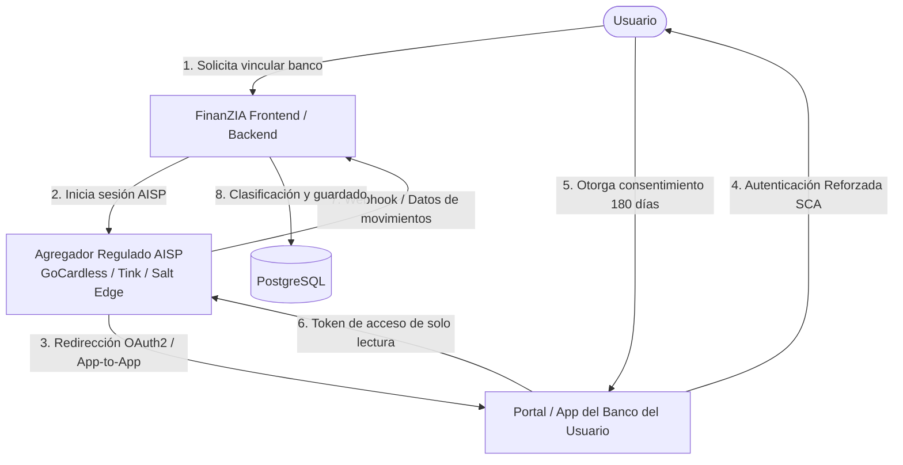
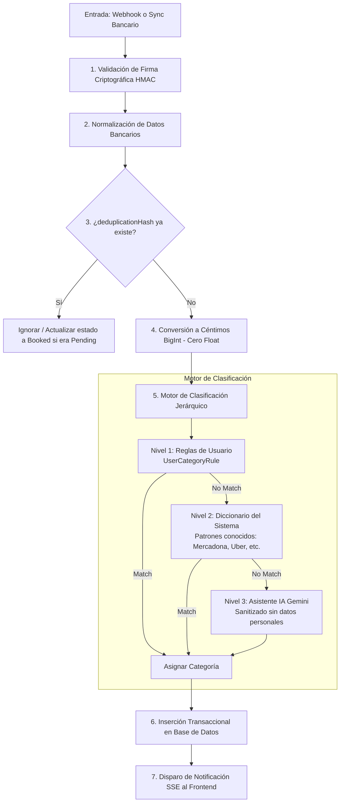

# FinanZIA — Plan de Implementación de Conexión Bancaria en Tiempo Real (Open Banking AIS) y Marco de Compliance

| Campo | Detalle |
| :--- | :--- |
| **Tipo de Característica** | Open Banking — Servicio de Información sobre Cuentas (AIS - Account Information Service) |
| **Alcance Operativo** | **Estrictamente Solo Lectura (Read-Only)**. Prohibición total de Iniciación de Pagos (PIS). |
| **Objetivo** | Sincronización automática de movimientos bancarios y cargos en tarjeta, deduplicación, almacenamiento en céntimos y clasificación inteligente en tiempo real. |
| **Entorno Técnico** | NestJS (Backend), Next.js (Frontend), PostgreSQL + Prisma, Gemini Flash (Clasificación). |
| **Fecha de Elaboración** | Septiembre 2026 |

---

## 1. Declaración de Principios y Alcance Estricto (Solo Lectura)

FinanZIA implementará **únicamente** la funcionalidad de **Servicio de Información sobre Cuentas (AIS)**. 

En ningún caso se implementará, diseñará ni facilitará la **Iniciación de Servicios de Pago (PIS)**:
1. FinanZIA **nunca** solicitará permisos para mover dinero, ejecutar transferencias ni realizar cargos.
2. FinanZIA **nunca** recopilará, almacenará ni procesará credenciales de acceso bancario (usuario/contraseña/PIN del banco) ni números completos de tarjetas de crédito (PAN) o códigos de seguridad (CVV/CVC).
3. Todo el acceso a los datos de las transacciones se efectuará bajo consentimiento explícito, granular, revocable y mediante redirección bancaria oficial protegida por **Autenticación Reforzada de Clientes (SCA)**.

---

## 2. Marco Regulatorio y Compliance Legal



### 2.1 Directiva Europea de Servicios de Pago (PSD2 / PSD3 y PSR)
* **Directiva (UE) 2015/2366 (PSD2)**: Regula dos figuras clave para terceros (TPPs - Third Party Providers):
  * **AISP (Account Information Service Provider)**: Acceso de solo lectura a saldos e historial de movimientos.
  * **PISP (Payment Initiation Service Provider)**: Capacidad de ordenar transferencias o pagos en nombre del usuario.
* **Modelo Operativo de FinanZIA (TSP bajo Umbrella de Agregador Regulado)**:
  * Obtener una licencia propia de AISP ante el Banco de España exige un capital mínimo de reserva, seguro de responsabilidad civil profesional homologado (mínimo ~50.000 € a 100.000 €) y auditorías anuales de seguridad.
  * **Solución Legal Estándar**: FinanZIA operará como **Proveedor de Servicios Técnicos (TSP - Technical Service Provider)** o **Agente** utilizando las APIs de un agregador financiero ya licenciado por la EBA / Banco de España (como **GoCardless Bank Account Data** o **Tink AB**). El agregador asume la condición de AISP regulado frente a los bancos; FinanZIA solo recibe los datos que el usuario autorizó expresamente en la pantalla del agregador/banco.

### 2.2 Autenticación Reforzada de Clientes (SCA) y Plazos de Consentimiento
* **Norma Técnica de Regulación (RTS - EBA-RTS-2017-10 / Reglamento Delegado UE 2018/389)**:
  * El usuario se autentica directamente contra la interfaz de su banco (Redirección o App-to-App con biometría FaceID/Huella o SMS OTP).
  * **Regla de los 180 días (Enmienda EBA UE 2022/2360)**: El consentimiento de lectura otorgado por el usuario tiene una validez máxima de **180 días**. Cumplido dicho plazo, el sistema debe solicitar al usuario que vuelva a validar su identidad con el banco para renovar el acceso.

### 2.3 RGPD (Reglamento UE 2016/679) y LOPDGDD 3/2018
* **Minimización de Datos (Art. 5.1.c RGPD)**: FinanZIA únicamente almacena los campos de la transacción estrictamente requeridos para la gestión financiera personal (Fecha, Concepto/Comercio, Importe en céntimos, Moneda, Estado pendiente). No se recopilan saldos de productos de inversión o hipotecas no vinculados.
* **Consentimiento Explícito y Revocable (Art. 6.1.a y 7.3 RGPD)**:
  * Checkbox desmarcado por defecto informando qué datos se sincronizan y con qué finalidad.
  * Botón visible de **"Desvincular cuenta bancaria"** que elimina de inmediato los tokens de acceso del agregador y, a elección del usuario, purga el historial descargado (Derecho de Supresión - Art. 17 RGPD).
* **Cifrado de Secretos y Tokens (Art. 32 RGPD)**:
  * Los `requisitionId` y `accessToken` del agregador nunca se guardan en texto plano en la base de datos: se cifran mediante **AES-256-GCM** utilizando una clave maestra `BANK_ENCRYPTION_KEY` definida en el backend.

### 2.4 Exención de PCI-DSS (Payment Card Industry Data Security Standard)
* Muchas plataformas cometen el error de intentar leer movimientos de tarjetas solicitando el número de 16 dígitos de la tarjeta (PAN). Esto activaría inmediatamente la necesidad de certificación **PCI-DSS Level 1-4**, con costes de auditoría exorbitantes.
* **Estrategia FinanZIA**: Las tarjetas de crédito y débito se vinculan **a través de la cuenta bancaria matriz vía Open Banking**. Las transacciones con tarjeta aparecen reflejadas en el extracto de la cuenta provisto por la API del banco (identificadas con el comercio y los 4 últimos dígitos de la tarjeta si el banco lo incluye en el concepto). Al no transmitir, procesar ni almacenar nunca el PAN ni el CVV, **FinanZIA queda 100% fuera del alcance (Out of Scope) de PCI-DSS**.

### 2.5 Prevención de Blanqueo de Capitales (Ley 10/2010 en España)
* Al ser un servicio puramente informativo (AIS) que no custodia fondos ni ejecuta transferencias, FinanZIA **no es un sujeto obligado** de reporte regulatorio ante el SEPBLAC en esta etapa.

---

## 3. Análisis Técnico de Herramientas y APIs Candidatas

| Criterio | GoCardless Bank Account Data (Nordigen) | Tink (Visa Company) | Plaid (Plaid Europe) | Salt Edge |
| :--- | :--- | :--- | :--- | :--- |
| **Licencia AISP** | GoCardless Bank Ltd / UAB (Lituania/UK) | Tink AB (Finansinspektionen, Suecia) | Plaid Financial Ltd (FCA / EBA) | Salt Edge Inc. (EBA / NBB) |
| **Modelo Comercial** | **Capa gratuita disponible** (50 llamadas/mes por cuenta, freemium) | De pago (Pay as you grow / Enterprise) | De pago (SaaS por conexión activa) | De pago (Plan startup) |
| **Cobertura en España** | Muy alta (>95% de entidades: Santander, BBVA, CaixaBank, Sabadell, Revolut, ING, Openbank, etc.) | Excelente (>98% de entidades) | Buena, pero menor penetración en cajas rurales | Alta |
| **Tiempo Real / Webhooks** | Soporta Webhooks de actualización y llamadas bajo demanda | Webhooks nativos en tiempo real (`transacciones creadas`) | Webhooks (`SYNC_UPDATES_AVAILABLE`) | Webhooks completos |
| **Sandbox / Simulación** | Banco de pruebas ficticio (`SANDBOXFINANCE_SBN0000`) completo y gratuito | Consola sandbox con generador de eventos | Sandbox integrado | Sandbox completo |
| **Facilidad de Integración** | REST API directa sin librerías obligatorias en cliente | SDK Frontend + REST API | Plaid Link SDK + REST API | REST API |

### Recomendación para FinanZIA:
1. **Opción Primaria Recomendada**: **GoCardless Bank Account Data (anteriormente Nordigen)**.
   * *Justificación*: Es la única plataforma con un plan gratuito generoso para desarrolladores y startups europeas. Permite crear requisiciones de consentimiento PSD2 de 180 días, conectarse a todos los bancos españoles y probar todo el flujo en local con su banco Sandbox sin coste.
2. **Alternativa Enterprise**: **Tink (Visa)**.
   * *Justificación*: En caso de buscar acuerdos corporativos futuros o integración directa en Azure Marketplace.

---

## 4. ¿Cómo Funciona el "Tiempo Real" en Open Banking?

1. **Tarjetas y Cuentas**: Cuando el usuario paga con su tarjeta en un datáfono o tienda online, el banco genera inicialmente una **transacción pendiente (Pending / Retención)**.
2. **Latencia Bancaria**: La directiva PSD2 obliga a los bancos a exponer APIs, pero no todos los bancos tradicionales emiten un webhook inmediato en el milisegundo exacto del pago. Neobancos (como Revolut, N26) lo hacen al instante; bancos tradicionales (como BBVA o Santander) reflejan la retención en su API entre 1 y 15 minutos tras el cargo.
3. **Mecanismo Híbrido de Tiempo Real en FinanZIA**:
   * **Canal 1 (Webhooks Push del Agregador)**: FinanZIA expone un endpoint seguro (`POST /api/webhooks/banking/gocardless`). Cuando el banco detecta actividad, el agregador envía un evento webhook al backend.
   * **Canal 2 (Sincronización Periódica / Polling Background)**: Un servicio cron en segundo plano consulta los bancos conectados respetando el límite PSD2 (hasta 4 actualizaciones desatendidas por día por cuenta, o ilimitadas en tiempo real cuando el usuario abre la aplicación).
   * **Canal 3 (Push In-App mediante Server-Sent Events / WebSockets)**: En cuanto el backend de FinanZIA ingesta y clasifica la transacción, emite un evento en tiempo real al frontend `finanzia-web`, haciendo que aparezca inmediatamente en pantalla con una animación sutil sin requerir recargar la página.

---

## 5. Pipeline de Ingesta, Deduplicación y Clasificación Automática



### 5.1 Regla Cero Float (Importes en Céntimos)
En estricto cumplimiento de las reglas globales de FinanZIA, ningún importe bancario se maneja como `Float` o `Number`. Todo importe en la API (ejemplo: `-14.50 EUR`) se convierte inmediatamente a `BigInt` entero en céntimos (`-1450n`).

### 5.2 Algoritmo de Deduplicación Robusta
Dado que las APIs bancarias actualizan transacciones pasando de estado `isPending: true` a consolidado (`isPending: false`), se genera un hash determinista SHA-256:
```typescript
deduplicationHash = sha256(
  `${accountId}:${bankInternalTransactionId || (date + ':' + amountCents + ':' + description)}`
);
```
Si el registro ya existe en estado pendiente y la nueva lectura lo marca como definitivo, se actualiza el registro en lugar de duplicarlo.

### 5.3 Sanitización previa a la Clasificación con IA (Gemini)
Antes de enviar el concepto a Gemini si las reglas locales no encontraron categoría:
* Se eliminan números de tarjeta parciales (`**** 1234`).
* Se eliminan códigos IBAN o referencias de transferencia SEPA.
* Solo se envía: `"Concepto: RESTAURANTE LA PARRILLA MADRID, Importe: 28.50 EUR"`.

---

## 6. Modificaciones de Base de Datos (Prisma Schema)

```prisma
// ---------------------------------------------------------
// EXTENSIÓN PARA OPEN BANKING (AIS)
// ---------------------------------------------------------

enum BankConnectionStatus {
  INITIALIZED      // Requisición creada, esperando autorización del usuario
  LINKED           // Conectado y autorizado activamente
  EXPIRED          // Consentimiento de 180 días caducado, requiere renovación
  REVOKED          // Desvinculado voluntariamente por el usuario
  ERROR            // Error de conexión con la entidad bancaria
}

/// Registro de la conexión del usuario con una entidad financiera vía Open Banking
model BankConnection {
  id                    String               @id @default(uuid())
  userId                String
  institutionId         String               // Identificador del banco (ej. 'SANDBOXFINANCE_SBN0000', 'SANTANDER_ES')
  institutionName       String               // Nombre visible (ej. 'Banco Santander', 'BBVA')
  institutionLogo       String?              // URL del logo del banco
  requisitionId         String               @unique // ID de requisición de GoCardless / Tink
  encryptedAccessToken  String?              @db.Text // Token cifrado con AES-256-GCM
  encryptedRefreshToken String?              @db.Text // Refresh token cifrado con AES-256-GCM
  status                BankConnectionStatus @default(INITIALIZED)
  consentExpiresAt      DateTime             // Fecha límite del consentimiento (máx 180 días)
  lastSyncedAt          DateTime?            // Última sincronización exitosa
  createdAt             DateTime             @default(now())
  updatedAt             DateTime             @updatedAt

  user                  User                 @relation(fields: [userId], references: [id], onDelete: Cascade)
  linkedAccounts        Account[]            // Cuentas locales de FinanZIA asociadas a este banco

  @@index([userId, status])
  @@map("bank_connections")
}
```

En el modelo existente `Account`, se añade:
* `bankConnectionId String?`: Relación opcional con `BankConnection`.
* `externalBankAccountId String?`: ID de la cuenta en la API del banco (IBAN anonimizado o hash).
* `isAutoSyncEnabled Boolean @default(true)`: Permite pausar la lectura automática.

---

## 7. Plan de Implementación Paso a Paso (Roadmap por Fases)

### Fase 1: Entorno Sandbox y Criptografía de Secretos
1. Registro en el portal de desarrolladores de GoCardless Bank Account Data.
2. Implementación en `finanzia-api` del servicio `EncryptionService` (cifrado simétrico AES-256-GCM para almacenar tokens de conexión).
3. Migración de Prisma con el nuevo modelo `BankConnection`.

### Fase 2: Integración de API AIS y Flujo de Consentimiento
1. Creación del módulo `BankingModule` en NestJS.
2. Endpoint `POST /api/banking/connect`: Genera un link seguro de consentimiento con el banco seleccionado mediante la API del agregador.
3. Endpoint de Callback `GET /api/banking/callback`: Recibe la confirmación tras la autenticación bancaria del usuario y asocia las cuentas.
4. Endpoint de Webhook `POST /api/webhooks/banking`: Valida la firma del agregador y procesa notificaciones de nuevos movimientos.

### Fase 3: Pipeline de Sincronización, Deduplicación y Clasificación
1. Mapeo del payload de transacciones del banco a la entidad `Transaction` (respetando céntimos).
2. Algoritmo de hash de deduplicación.
3. Integración con el motor de reglas existente (`UserCategoryRule`) y fallback a `GeminiSdkAdapter` para clasificación automática instantánea.

### Fase 4: Interfaz de Usuario y Alertas en Tiempo Real
1. Vista de **"Vincular Banco o Tarjeta"** en `finanzia-web`:
   * Selector con buscador de bancos (Santander, BBVA, CaixaBank, Revolut, etc.) y logos oficiales.
   * Banner de transparencia legal y consentimiento explícito (resaltando que es **solo lectura**).
2. Integración de canal en tiempo real (Server-Sent Events) en el dashboard: cuando se detecta un gasto con tarjeta, aparece un toast animado informando: *"Nuevo movimiento detectado: 12,50 € en Farmacia (clasificado en Salud)"*.
3. Pantalla de gestión de conexiones bancarias: visualización de días restantes de consentimiento (contador de 180 días) y botón de desvinculación inmediata.

### Fase 5: Auditoría de Seguridad y Cumplimiento Normativo
1. Pruebas de desvinculación: verificar que al pulsar "Desconectar banco", los tokens se revocan en la API del agregador y se borran de la base de datos.
2. Pruebas de inyección y aislamiento multi-tenant: garantizar que ningún usuario pueda recibir webhooks o consultar cuentas ajenas.
3. Documentación de Política de Privacidad y Términos de Servicio actualizados.

---

## 8. Fuentes Oficiales y Referencias de Cumplimiento

### Legislación y Normativa Oficial (Unión Europea y España)
1. **Directiva PSD2**: [Directiva (UE) 2015/2366 del Parlamento Europeo y del Consejo sobre servicios de pago en el mercado interior](https://eur-lex.europa.eu/legal-content/ES/TXT/?uri=CELEX:32015L2366)
2. **Normas Técnicas de Regulación (RTS) sobre SCA**: [Reglamento Delegado (UE) 2018/389 de la Comisión Europea](https://eur-lex.europa.eu/legal-content/ES/TXT/?uri=CELEX:32018R0389)
3. **Ampliación de Plazo de SCA a 180 días**: [Reglamento Delegado (UE) 2022/2360 de la Comisión que modifica las normas técnicas de la PSD2](https://eur-lex.europa.eu/legal-content/ES/TXT/?uri=CELEX:32022R2360)
4. **RGPD / GDPR**: [Reglamento (UE) 2016/679 relativo a la protección de las personas físicas en lo que respecta al tratamiento de datos personales](https://eur-lex.europa.eu/legal-content/ES/TXT/?uri=CELEX:32016R0679)
5. **Agencia Española de Protección de Datos (AEPD)**: [Guía sobre tecnologías y servicios financieros (Fintech y Open Banking)](https://www.aepd.es/guias/guia-fintech.pdf)
6. **Banco de España**: [Registro oficial de Proveedores de Servicios de Información sobre Cuentas (AISP)](https://www.bde.es/wbe/es/entidades-profesionales/servicios-pago/)
7. **Estándar de Seguridad PCI**: [PCI Security Standards Council — Exclusiones de alcance de datos de titulares de tarjetas](https://www.pcisecuritystandards.org/)

### Documentación Oficial de APIs y Agregadores
1. **GoCardless Bank Account Data (Nordigen API)**:
   * Portal y Documentación: [https://bankaccountdata.gocardless.com/overview/](https://bankaccountdata.gocardless.com/overview/)
   * Guía de Requisiciones y Flujo de Consentimiento: [https://developer.gocardless.com/bank-account-data/overview](https://developer.gocardless.com/bank-account-data/overview)
2. **Tink (Visa) Documentation**:
   * Documentación de Account Check & Transactions: [https://docs.tink.com/resources/transactions](https://docs.tink.com/resources/transactions)
   * Webhooks y Eventos de Actualización: [https://docs.tink.com/resources/webhooks](https://docs.tink.com/resources/webhooks)
3. **Plaid Documentation**:
   * API de Transacciones y Link: [https://plaid.com/docs/api/products/transactions/](https://plaid.com/docs/api/products/transactions/)
   * Guía de Seguridad y Cumplimiento: [https://plaid.com/safety/](https://plaid.com/safety/)
4. **Salt Edge Open Banking API**:
   * Documentación AIS y Seguridad ISO 27001: [https://www.saltedge.com/docs/open_banking/](https://www.saltedge.com/docs/open_banking/)
