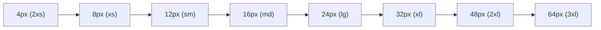
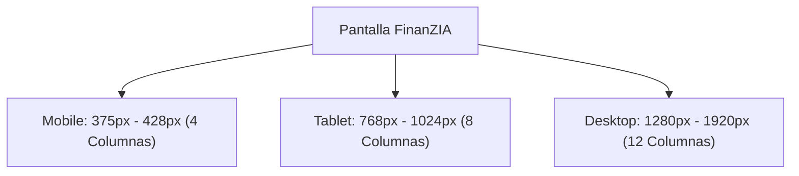
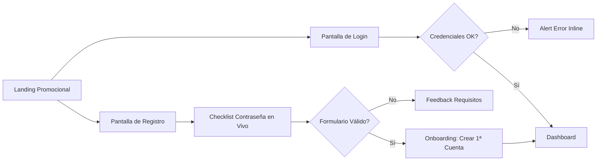

# FinanZIA — Arquitectura de Diseño y Especificación UI/UX (Figma Design System)

> **Documento de Especificación Oficial del Agente UI/UX Designer**  
> **Versión**: 1.0.0 | **Fecha**: 2026-09-15  
> **Alcance**: Design System, Tokens, Componentes Atómicos, Pantallas Core, Especificaciones Responsive y Guía de Handoff a Developer.

---

## 1. Filosofía de Diseño y Principios Rectores

FinanZIA es una plataforma financiera personal asistida por inteligencia artificial verificable y determinista. La experiencia visual y de interacción debe transmitir **rigor matemático, serenidad, control absoluto y modernidad tecnológica**.

### Principios Clave:
1. **Rigor y Cero Ambigüedad**: La información financiera no tolera inexactitudes. Todos los importes monetarios se expresan con formato estándar europeo (`1.250,50 €`), empleando tipografía monoespaciada para cifras y hashes. Cero números flotantes o redondeos visuales confusos.
2. **Dark Glassmorphism Premium**: Una paleta de fondo oscura profunda (`#0B0F19`) combinada con superficies de cristal esmerilado translúcido (*backdrop-filter blur 12px*), bordes sutiles de alta definición y acentos cromáticos vibrantes.
3. **Determinismo Visual y Human-in-the-Loop**: Las propuestas del Asistente de IA (Gemini) se presentan visualmente diferenciadas del contenido determinista mediante tarjetas con trazabilidad, etiquetas de herramientas ejecutadas y botones explícitos de aprobación humana (`[Aprobar y Aplicar]` vs `[Descartar]`).
4. **Mobile-First y Ergonomía Táctil**: Cada pantalla se concibe para operar con soltura tanto en dispositivos móviles táctiles (zonas de toque >= 44x44px, navegación inferior) como en grandes pantallas de escritorio (grillas analíticas multi-columna y barras laterales).
5. **Accesibilidad Universal (WCAG 2.1 AA)**: Ratios de contraste de texto superiores a 4.5:1, indicadores de foco accesibles para navegación por teclado y soporte semántico para lectores de pantalla.

---

## 2. Design Tokens del Sistema

### 2.1 Paleta Cromática y Tokens Semánticos

#### Fondos y Superficies (Dark Theme)
| Token Figma / CSS | Valor HEX | Valor HSL | Uso Principal |
| :--- | :--- | :--- | :--- |
| `--bg-primary` | `#0B0F19` | `hsl(222, 38%, 7%)` | Fondo principal de la aplicación |
| `--bg-surface` | `#111827` | `hsl(222, 39%, 11%)` | Superficies de contenedores, sidebars y modales |
| `--bg-surface-hover` | `#1F2937` | `hsl(217, 33%, 17%)` | Estados hover en filas y elementos interactivos |
| `--bg-card` | `rgba(17, 24, 39, 0.75)` | `hsla(222, 39%, 11%, 0.75)` | Tarjetas con efecto glassmorphism |
| `--bg-card-border` | `rgba(255, 255, 255, 0.08)` | `hsla(0, 0%, 100%, 0.08)` | Borde fino de definición de 1px en tarjetas |
| `--bg-card-border-hover` | `rgba(255, 255, 255, 0.18)` | `hsla(0, 0%, 100%, 0.18)` | Borde activo o en hover |

#### Acentos de Marca y Entidades Financieras
| Token Figma / CSS | Valor HEX | Valor HSL | Significado Semántico |
| :--- | :--- | :--- | :--- |
| `--brand-primary` | `#10B981` | `hsl(160, 84%, 39%)` | **Verde Esmeralda**: Crecimiento, Ingresos, Éxito |
| `--brand-primary-hover` | `#059669` | `hsl(160, 84%, 31%)` | Hover de botones primarios |
| `--brand-glow` | `rgba(16, 185, 129, 0.25)` | `hsla(160, 84%, 39%, 0.25)` | Resplandor en focos y botones destacados |
| `--accent-ai` | `#8B5CF6` | `hsl(258, 90%, 66%)` | **Violeta Inteligente**: FinanZIA AI Advisor |
| `--accent-ai-glow` | `rgba(139, 92, 246, 0.25)` | `hsla(258, 90%, 66%, 0.25)` | Halo de actividad en sugerencias de IA |

#### Semántica Financiera
| Estado / Flujo | Token CSS | Valor HEX | Uso en UI |
| :--- | :--- | :--- | :--- |
| **Ingreso (Income)** | `--status-income` | `#10B981` | Cifras positivas (`+`), badges de ingreso |
| **Gasto (Expense)** | `--status-expense` | `#F43F5E` | Cifras negativas (`-`), alertas de gasto excesivo |
| **Transferencia (Transfer)** | `--status-info` | `#3B82F6` | Movimiento neutro entre cuentas propias |
| **Advertencia (Warning)** | `--status-warning` | `#F59E0B` | Presupuesto al 80%, duplicados en CSV |
| **Peligro / Error (Danger)** | `--status-danger` | `#EF4444` | Presupuesto desbordado (>100%), errores API |

#### Escala de Textos
| Token Figma / CSS | Valor HEX | Ratio Contraste vs `--bg-primary` |
| :--- | :--- | :--- |
| `--text-primary` | `#F9FAFB` | **15.4:1** (Cumple WCAG AAA) |
| `--text-secondary` | `#9CA3AF` | **6.8:1** (Cumple WCAG AA) |
| `--text-muted` | `#6B7280` | **4.6:1** (Cumple WCAG AA para textos secundarios) |
| `--text-disabled` | `#4B5563` | Para elementos no interactivos |

---

### 2.2 Tipografía y Escala Jerárquica

- **Tipografía de Display y Títulos**: `'Outfit', sans-serif` (Carácter moderno, geométrico y accesible).
- **Tipografía de Cuerpo y Controles**: `'Inter', sans-serif` (Claridad suiza, óptima para lectura y tablas densas).
- **Tipografía Numérica y Datos Críticos**: `'JetBrains Mono', monospace` (Alineación perfecta de decimales, importes en céntimos y hashes SHA-256).

| Nivel Tipográfico | Familia | Peso | Tamaño / Interlínea | Tracking | Uso en Pantalla |
| :--- | :--- | :---: | :---: | :---: | :--- |
| **Display 1** | Outfit | 700 (Bold) | `36px / 44px` | `-0.03em` | Cifras de patrimonio global en Dashboard |
| **Heading 1 (H1)** | Outfit | 600 (SemiBold) | `28px / 36px` | `-0.02em` | Título de página principal |
| **Heading 2 (H2)** | Outfit | 600 (SemiBold) | `22px / 30px` | `-0.02em` | Título de secciones y modales |
| **Heading 3 (H3)** | Outfit | 500 (Medium) | `18px / 26px` | `-0.01em` | Títulos de tarjetas y widgets |
| **Body Large** | Inter | 400 (Regular) | `16px / 24px` | `0` | Párrafos destacados, formularios |
| **Body Medium (Base)** | Inter | 400 (Regular) | `14px / 20px` | `0` | Texto estándar, tablas, etiquetas |
| **Body Small** | Inter | 400 (Regular) | `12px / 16px` | `+0.01em` | Notas al pie, metadatos, timestamps |
| **Mono Numbers (XL)** | JetBrains Mono | 600 (SemiBold) | `32px / 40px` | `-0.02em` | `MoneyDisplay` tamaño XL |
| **Mono Numbers (Base)**| JetBrains Mono | 500 (Medium) | `14px / 20px` | `0` | Importes en tablas de movimientos |
| **Caption / Badge** | Inter | 600 (SemiBold) | `11px / 14px` | `+0.04em` | Badges en mayúsculas, pills |

---

### 2.3 Escala Espacial (8-Point Grid) y Elevación



- **Tokens de Espaciado**:
  - `space-1` = `4px` (Espaciado interno de badges, separaciones mínimas).
  - `space-2` = `8px` (Gap en grupos de botones compactos, icon padding).
  - `space-3` = `12px` (Padding interno de inputs y celdas de tabla).
  - `space-4` = `16px` (Padding base de cards en móvil, margins de layout móvil).
  - `space-6` = `24px` (Padding de cards en desktop, grid gutters).
  - `space-8` = `32px` (Margen entre secciones principales).
  - `space-12` = `48px` (Margen superior de vistas, hero sections).
  - `space-16` = `64px` (Separación máxima de páginas).

- **Radios de Borde (Border Radius)**:
  - `--radius-sm`: `6px` (Tags, chips pequeños, select items).
  - `--radius-md`: `10px` (Botones estándar, inputs, dropdowns).
  - `--radius-lg`: `16px` (Cards principales, modales, bottom sheets).
  - `--radius-xl`: `24px` (Tarjetas hero destacadas, banners).
  - `--radius-full`: `9999px` (Badges píldora, avatares, toggles).

- **Sombras y Efectos Glassmorphism**:
  - **Level 1 (Subtle)**: `0 2px 8px 0 rgba(0, 0, 0, 0.25)`
  - **Level 2 (Card Glass)**: `0 8px 32px 0 rgba(0, 0, 0, 0.37)`, backdrop-filter: `blur(12px)`
  - **Level 3 (Modal & Floating)**: `0 16px 48px 0 rgba(0, 0, 0, 0.55)`, backdrop-filter: `blur(16px)`
  - **Brand Glow**: `0 0 20px 2px rgba(16, 185, 129, 0.20)`
  - **AI Glow**: `0 0 24px 3px rgba(139, 92, 246, 0.22)`

---

## 3. Arquitectura del Archivo de Figma

La organización de páginas dentro del archivo Figma de FinanZIA sigue una estructura modular estricta orientada a equipos de ingeniería y producto:

```
📁 FinanZIA — Official UI/UX Design System
├── 📄 00_Overview & Version History
├── 🎨 01_Design Tokens (Colors, Typography, Elevation, Grids)
├── 🧩 02_Atoms (Buttons, Inputs, Badges, Icons, Tooltips)
├── 📦 03_Molecules (AccountCard, TransactionRow, MoneyDisplay, Dropzone)
├── 🏛️ 04_Organisms (Navbar, Sidebar, Modals, WizardHeader, Tables)
├── 📱 05_Templates_Mobile (375px & 390px Views)
├── 💻 06_Templates_Desktop (1440px Views)
├── 🔐 07_Flow: Auth & Onboarding
├── 📊 08_Flow: Dashboard & Accounts
├── 💳 09_Flow: Transactions & Transfers
├── 📄 10_Flow: CSV Bank Import Wizard
├── 🎯 11_Flow: Budgets & Savings Goals
├── 🤖 12_Flow: FinanZIA AI Advisor (Human-in-the-Loop)
└── 📐 13_Handoff & Component Matrix for Storybook
```

---

## 4. Biblioteca de Componentes Atómicos y Moléculas

### 4.1 Botones (`Button`)
- **Variantes**:
  1. `Primary`: Fondo `--brand-primary`, texto oscuro/blanco de alto contraste, halo en hover.
  2. `Secondary / Glass`: Fondo `rgba(255,255,255,0.06)`, borde de 1px `--bg-card-border`.
  3. `Outline`: Fondo transparente, borde de 1px visible, texto `--text-primary`.
  4. `Danger`: Fondo `rgba(244, 63, 94, 0.15)`, borde y texto `--status-expense`.
  5. `Ghost / Text`: Sin fondo ni bordes, para acciones terciarias y paginadores.
  6. `AI Action`: Fondo degradado violeta (`#8B5CF6` a `#6D28D9`), reservado para acciones con IA.
- **Tamaños**:
  - `sm`: Altura 32px, padding horizontal 12px, font 12px.
  - `md` (Predeterminado): Altura 40px, padding horizontal 16px, font 14px.
  - `lg`: Altura 48px, padding horizontal 24px, font 16px (Touch friendly).
- **Estados Requeridos**: `Default`, `Hover`, `Active` (scale 0.98), `Focus-visible` (ring 2px `--brand-primary`), `Disabled` (opacity 0.4), `Loading` (Spinner circular SVG integrado, ancho fijo).

### 4.2 Entradas de Datos (`Input`, `Select`, `Textarea`)
- **Estructura**: Etiqueta superior con indicador de obligatoriedad (`*`), contenedor con icono opcional a la izquierda, sufijo/moneda a la derecha, y mensaje de error/ayuda inferior.
- **Estados**:
  - `Default`: Borde `--bg-card-border`, fondo `rgba(0,0,0,0.2)`.
  - `Focus`: Borde `--brand-primary`, halo `--brand-glow`.
  - `Error`: Borde `--status-expense`, texto explicativo en color carmesí con icono `AlertCircle`.
  - `Success / Validated`: Borde `--status-income` con checkmark verde.
  - `Disabled`: Fondo oscurecido, cursor not-allowed.

### 4.3 Componente `MoneyDisplay` (Especificación Estricta)
- **Propósito**: Visualizar cantidades monetarias con rigor matemático en céntimos enteros.
- **Formato**: Separador de miles por punto (`.`), separador decimal por coma (`,`), símbolo de euro al final (`€`) con espacio de no separación (`&nbsp;`).
- **Variantes de Color**:
  - `income`: Verde esmeralda con prefijo obligatorio `+` (ej. `+1.500,00 €`).
  - `expense`: Rosa carmesí con prefijo obligatorio `-` (ej. `-45,90 €`).
  - `neutral`: Blanco/gris según jerarquía (ej. `3.420,15 €`).
- **Escala de Tamaños**: `xs` (12px), `sm` (14px), `md` (16px), `lg` (20px), `xl` (28px), `2xl` (36px).

### 4.4 Tarjetas Financieras (`AccountCard`)
- **Contenido**:
  - Nombre de la cuenta (ej. "N26 Principal", "Cuenta Ahorro Santander").
  - Badge tipo de cuenta (`CHECKING`, `SAVINGS`, `CREDIT_CARD`, `CASH`, `INVESTMENT`).
  - Saldo actual con `MoneyDisplay` tamaño `lg`.
  - Indicador de divisa (`EUR`).
  - Menú contextual de opciones rápidas (3 puntos).
- **Tratamiento Gráfico**: Gradiente lineal muy tenue en el fondo de la tarjeta (ángulo 135deg) para diferenciar el tipo de banco o cuenta sin perder sobriedad.

### 4.5 Filas de Transacciones (`TransactionRow`)
- **Contenido**:
  - Icono redondo de categoría con fondo suave de color asociado.
  - Columna de información: Concepto principal (bold) y subtítulo con fecha bancaria formateada (`DD/MM/AAAA`) y cuenta origen.
  - Badge opcional de estado: `Pendiente`, `Conciliado`, `Transferencia`.
  - Importe formateado alineado a la derecha en tipografía `JetBrains Mono`.

### 4.6 Barras de Ritmo Presupuestario (`BudgetProgressBar`)
- **Componentes**:
  - Cabecera: Nombre de categoría + Importe consumido vs Límite fijado (ej. `320,00 € / 400,00 €`).
  - Pista de progreso: Altura 8px con `--radius-full`.
  - Barra de llenado con transición animada de anchura:
    - **< 80% consumo**: Color `--status-income` (Verde esmeralda).
    - **80% a 99% consumo**: Color `--status-warning` (Ámbar de alerta).
    - **>= 100% consumo (desbordado)**: Color `--status-expense` (Rojo carmesí con efecto pulso sutil).
  - Marcador del umbral de alerta (línea vertical a la altura del 80%).

### 4.7 Componentes del Asistente FinanZIA AI (Human-in-the-Loop)
1. **`ToolExecutionPill`**:
   - Píldora compacta que muestra la ejecución determinista en el backend (ej. `⚙️ get_monthly_balance()`).
   - Estado: `Ejecutando...` (con pulso violeta) o `Verificado` (con checkmark).
2. **`RecommendationCard` (Aprobación Obligatoria)**:
   - Tarjeta destacada con borde violeta (`--accent-ai`) y badge `Propuesta de IA`.
   - Título y justificación basada en datos reales del usuario.
   - Tabla o desglose de impacto (ej. *Ajuste: Reducir Restauración en 50,00 € y aumentar Ahorro Vacaciones en 50,00 €*).
   - Acciones explícitas:
     - Botón `[Aprobar y Aplicar]` (Variante Primary con icono de check).
     - Botón `[Descartar]` (Variante Ghost).

---

## 5. Estrategia Responsive y Breakpoints



### 5.1 Especificación por Dispositivo

| Parámetro de Grilla | Mobile (Compact) | Tablet (Medium) | Desktop (Expanded) |
| :--- | :--- | :--- | :--- |
| **Breakpoint** | `375px` a `767px` | `768px` a `1279px` | `1280px` o superior |
| **Ancho de Referencia Figma** | **`390px`** (iPhone 14/15) | **`768px`** (iPad Mini/Air) | **`1440px`** (MacBook Pro) |
| **Número de Columnas** | 4 | 8 | 12 |
| **Márgenes Exteriores** | 16px | 24px | 32px a 48px |
| **Gutter (Separación)** | 12px | 16px | 24px |
| **Navegación Principal** | Barra inferior fija (Bottom Nav) | Barra lateral compacta (Iconos) | Barra lateral expandida (Sidebar) |
| **Comportamiento de Modales** | Bottom Sheet deslizable | Modal centrado (560px max) | Modal centrado (640px max) |
| **Disposición de Cards** | 1 Columna (Stack vertical) | 2 Columnas | 3 o 4 Columnas |

---

## 6. Mapa Detallado de Pantallas y Wireflows

### 6.1 Flujo 1: Autenticación y Onboarding



#### Pantallas a Diseñar en Figma:
1. `AUTH_01_Login_Desktop` y `AUTH_01_Login_Mobile`:
   - Logo FinanZIA con icono de rayo de energía financiera (`⚡`).
   - Inputs: Email y Contraseña con toggle de visibilidad (icono de ojo).
   - Botón destacado `Entrar a FinanZIA`.
   - Card interactiva de credenciales de prueba (`tester@finanzia.local`).
2. `AUTH_02_Register_Desktop` y `AUTH_02_Register_Mobile`:
   - Inputs: Nombre, Apellidos, Email, Contraseña.
   - **Widget dinámico de requisitos de seguridad de contraseña**:
     - `✓ Mínimo 8 caracteres`
     - `✓ Al menos una mayúscula`
     - `✓ Al menos un número`
     - `✓ Al menos un símbolo especial (!@#$...)`
   - Los indicadores cambian de gris a verde esmeralda instantáneamente según el usuario teclea.
3. `AUTH_03_Onboarding_FirstAccount`:
   - Modal o pantalla limpia invitando al usuario a registrar su cuenta bancaria de apertura y saldo inicial en euros.

---

### 6.2 Flujo 2: Dashboard Principal y Cuentas

#### Pantallas a Diseñar en Figma:
1. `DASH_01_Overview_Desktop (1440px)`:
   - **Sidebar fija izquierda (260px)**: Logo, Links (Dashboard, Cuentas, Transacciones, Presupuestos, Metas, Importar CSV, Asistente AI), Perfil de usuario y botón `Cerrar Sesión`.
   - **Top Header**: Saludo personalizado (*"Hola, Miguel"*), badge de estado de conexión local en vivo y enlace a Swagger docs.
   - **Fila Superior de KPIs**:
     - *Card 1*: Patrimonio Total Líquido (Consolidado de todas las cuentas con `MoneyDisplay XL`).
     - *Card 2*: Balance del Mes (Ingresos vs Gastos con mini barra comparativa).
     - *Card 3*: Acciones Rápidas (`+ Movimiento`, `↔ Transferencia`, `↑ Importar CSV`).
   - **Sección de Cuentas**: Grid horizontal con `AccountCard` por cada entidad bancaria.
   - **Sección de Actividad Reciente**: Tabla con los últimos 10 movimientos y botón para ir al historial completo.
2. `DASH_01_Overview_Mobile (390px)`:
   - Top Bar con Avatar y Logo.
   - Card vertical de patrimonio con acciones rápidas apiladas en fila con scroll horizontal.
   - Carrusel deslizable de cuentas bancarias.
   - Lista táctil de movimientos recientes.
   - **Bottom Navigation Bar (5 accesos rápidos)**: Dashboard, Movimientos, Importar, Metas, Asistente IA.

---

### 6.3 Flujo 3: Registro y Conciliación de Transacciones

#### Pantallas a Diseñar en Figma:
1. `TX_01_List_Desktop` y `TX_01_List_Mobile`:
   - Barra de filtros: Buscador por texto, selector de Cuenta, selector de Categoría, rango de fechas y chips de tipo (`Todos`, `Ingresos`, `Gastos`, `Transferencias`).
   - Tabla paginada de transacciones con selección múltiple para acciones por lote.
2. `TX_02_Modal_CreateTransaction`:
   - Selector visual tipo Switch: `Gasto` (rojo) vs `Ingreso` (verde).
   - Input monetario grande con formato automático de moneda y céntimos.
   - Selectores de Cuenta, Categoría (con icono y color) y Fecha con datepicker accesible.
3. `TX_03_Modal_CreateTransfer`:
   - Selector de Cuenta Origen y Cuenta Destino.
   - Advertencia automática de validación si ambas cuentas son iguales o si la divisa difiere.

---

### 6.4 Flujo 4: Asistente Interactivo de Importación CSV (Wizard)

```mermaid
sequenceDiagram
    autonumber
    actor U as Usuario
    participant W as Wizard UI
    participant P as Preview & Reconciler
    
    U->>W: Paso 1: Arrastra extracto bancario .csv
    W->>W: Autodetecta separador (;, coma, tab)
    W->>W: Paso 2: Presenta ColumnMapper
    U->>W: Asocia columnas Fecha, Concepto, Importe y Banco (ej. "BBVA")
    U->>W: Marca checkbox "Recordar plantilla para este banco"
    W->>P: Paso 3: Muestra ImportPreviewTable con hashes SHA-256
    P-->>U: Resalta transacciones duplicadas detectadas en la BD
    U->>P: Confirma importación de filas no duplicadas
    P->>U: Paso 4: Resumen de éxito e impacto en balances
```

#### Pantallas a Diseñar en Figma:
1. `CSV_01_UploadDropzone`:
   - Contenedor drag & drop con estados hover y advertencias de seguridad contra inyecciones de fórmulas.
2. `CSV_02_ColumnMapper`:
   - Vista de mapeo interactivo con previsualización de las primeras 3 filas del archivo subido.
   - Selectores de correspondencia: Columna de Fecha, Formato (`DD/MM/AAAA`), Columna de Concepto y Columna de Importe.
   - Input para nombrar y guardar la plantilla del banco.
3. `CSV_03_PreviewAndDuplicates`:
   - Tabla de reconciliación con badges de estado:
     - `🟢 Nueva`: Lista para insertar.
     - `🟡 Duplicada`: Detectada por hash unívoco SHA-256 en la base de datos (con opción de forzar o ignorar).
4. `CSV_04_SummaryModal`:
   - Tarjeta de confirmación: *X transacciones importadas, Y duplicadas ignoradas, saldo actualizado en cuenta*.

---

### 6.5 Flujo 5: Presupuestos y Metas de Ahorro

#### Pantallas a Diseñar en Figma:
1. `BUDGET_01_Overview`:
   - Selector de mes y año (ej. *Septiembre 2026*).
   - Grid de `BudgetProgressBar` por cada categoría activa.
   - Alerta visual destacada en cabecera si el gasto acumulado excede el 80% del límite global.
2. `GOALS_01_SavingsDashboard`:
   - Tarjetas de objetivos de ahorro (ej. *"Fondo de Emergencia"*, *"Vacaciones en Japón"*).
   - Gráfico circular de progreso y fecha estimada de consecución.
   - Botón `Aportar a Meta` con modal de traspaso desde cuenta corriente.

---

### 6.6 Flujo 6: Asistente FinanZIA AI y Human-in-the-Loop

#### Pantallas a Diseñar en Figma:
1. `AI_01_Chat_Desktop` y `AI_01_Chat_Mobile`:
   - Panel lateral de historial de conversaciones y botón `Nueva Consulta`.
   - Área de mensajes con burbujas diferenciadas:
     - Mensaje del Usuario: Alineado a la derecha con fondo gris suave.
     - Mensaje del Asistente: Alineado a la izquierda con avatar FinanZIA AI y halo violeta tenue.
   - `ToolExecutionPill` animada cuando el modelo invoca herramientas del backend.
   - Input inferior con prompts sugeridos rápidos (*"¿Cómo va mi presupuesto este mes?"*, *"¿Dónde gasté más la última semana?"*).
2. `AI_02_RecommendationCard_States`:
   - Estado 1: `Propuesta` (esperando decisión del usuario).
   - Estado 2: `Aprobada y Aplicada` (badge verde con confirmación de actualización en base de datos).
   - Estado 3: `Descartada` (badge gris con registro auditado).

---

## 7. Criterios de Accesibilidad y Ergonomía (WCAG 2.1 AA)

1. **Ratios de Contraste**:
   - Todo texto sobre fondo oscuro debe superar **4.5:1** para texto normal y **3:1** para texto de gran tamaño (>= 18px bold o 24px regular).
   - Los bordes interactivos deben poseer un contraste mínimo de **3:1** contra el fondo adyacente.
2. **Navegación por Teclado y Estados Focus**:
   - Todos los elementos interactivos cuentan con un anillo de foco visible (`outline: 2px solid var(--brand-primary); outline-offset: 2px`).
   - Cero trampas de foco en modales (tecla `Escape` cierra el modal y el foco retorna al elemento disparador).
3. **Áreas Táctiles en Móvil**:
   - Todo botón, enlace o control en la versión Mobile debe contar con un área de toque efectiva mínima de **`44 x 44 px`**.
4. **Semántica de Color**:
   - La información nunca se transmite exclusivamente mediante color. Cada estado financiero o alerta incluye iconos semánticos (`TrendingUp`, `TrendingDown`, `AlertTriangle`, `CheckCircle`) y etiquetas textuales.

---

## 8. Guía de Handoff para el Agente Developer

Para garantizar que el agente **Developer** implemente las interfaces con precisión de píxel idéntica al diseño de Figma, se establece el siguiente estándar de equivalencia:

### Mapeo de Tokens Figma a Código Next.js

| Elemento Figma | Propiedad CSS / Token en `globals.css` | Módulo / Componente React |
| :--- | :--- | :--- |
| **Color Fondo Tarjeta** | `background: var(--bg-card);` | `.glassCard` |
| **Borde Vidrio** | `border: 1px solid var(--bg-card-border);` | `.glassCard` |
| **Desenfoque Fondo** | `backdrop-filter: var(--glass-blur);` | `.glassCard` |
| **Texto de Importes** | `font-family: var(--font-mono);` | `<MoneyDisplay />` |
| **Radio de Botón** | `border-radius: var(--radius-md);` | `<Button />` |
| **Espaciado Interno Card** | `padding: 1.5rem;` (`24px` en desktop) | CSS Module local |
| **Color Ingreso** | `color: var(--status-income);` | `<Badge variant="income" />` |
| **Color Gasto** | `color: var(--status-expense);` | `<Badge variant="expense" />` |

### Historias de Storybook a Mantener y Crear (`finanzia-web/stories`):
1. `stories/Button.stories.tsx` (Todas las variantes, tamaños y estados loading).
2. `stories/Input.stories.tsx` (Default, focus, error con mensaje, con prefijo/sufijo).
3. `stories/MoneyDisplay.stories.tsx` (Formatos enteros en céntimos, tamaños y colores).
4. `stories/Badge.stories.tsx` (Variantes semánticas financieras).
5. `stories/AccountCard.stories.tsx` (Cuentas corrientes, ahorro, tarjetas).
6. `stories/BudgetProgressBar.stories.tsx` (Estados normal, alerta al 80%, desbordado al 100%).
7. `stories/RecommendationCard.stories.tsx` (Tarjeta de recomendación de IA con acciones).
8. `stories/ColumnMapper.stories.tsx` (Mapeo de extractos bancarios CSV).

---

## 9. Checklist de Verificación de Diseño y Aprobación

- [x] Tokens cromáticos HSL, RGB y HEX definidos con soporte dark mode.
- [x] Jerarquía tipográfica con Outfit, Inter y JetBrains Mono especificada.
- [x] Escala espacial de 8pt grid y radios de borde definidos.
- [x] Biblioteca de componentes atómicos con todos sus estados interactivos.
- [x] Especificación responsive con grillas y comportamientos (Mobile, Tablet, Desktop).
- [x] Wireflows y pantallas de todos los módulos nucleares (Auth, Dashboard, Cuentas, Transacciones, CSV Wizard, Presupuestos, Metas y Asistente IA).
- [x] Criterios de accesibilidad WCAG 2.1 nivel AA verificados.
- [x] Mapeo de tokens y componentes listo para handoff al agente Developer.
