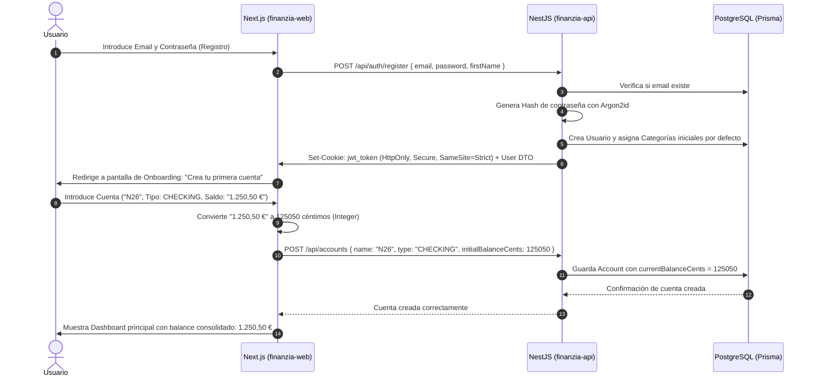
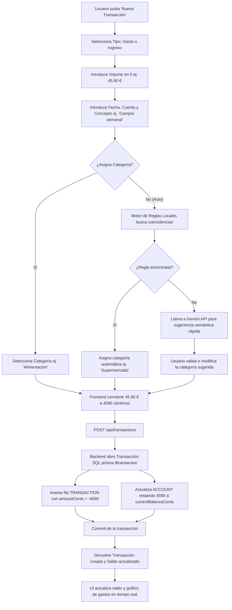
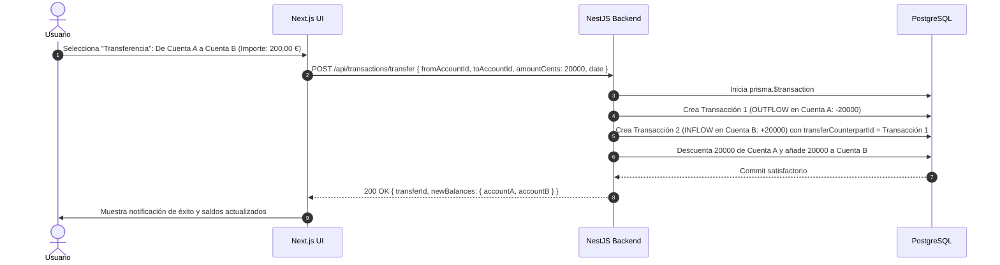
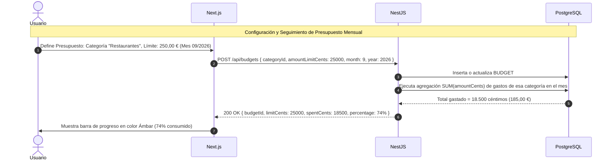
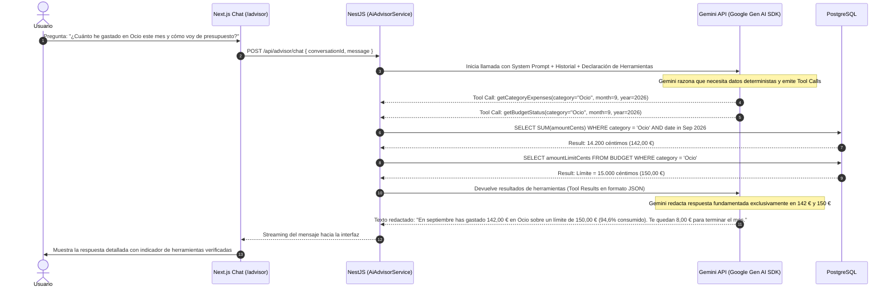
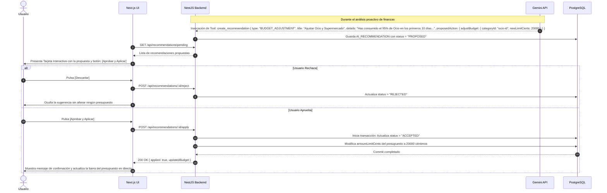

# FinanZIA — Flujos de Usuario y Casos de Uso (User Flows)

Este documento detalla los flujos de interacción e intercambio de datos para las funcionalidades nucleares del MVP de FinanZIA.

---

## Flujo 1: Registro, Autenticación y Onboarding de Cuentas



---

## Flujo 2: Registro Manual de Transacciones y Transferencias

### 2.1 Registro de Gasto / Ingreso


### 2.2 Transferencia entre Cuentas Propias


---

## Flujo 3: Asistente de Importación de Extracto Bancario (CSV)

```mermaid
flowchart TD
    A[Usuario sube archivo .csv en /imports] --> B[Frontend analiza delimitador: coma o punto y coma]
    B --> C[Frontend muestra primeras 5 filas en tabla de muestra]
    C --> D{¿Existe plantilla guardada para este banco?}
    D -- Sí --> E[Aplica mapeo automático de columnas preexistente]
    D -- No --> F[Usuario asocia selectores: Columna Fecha, Concepto e Importe]
    F --> G[Opción: 'Guardar plantilla para este banco' ej. 'BBVA']
    E --> H[Frontend procesa y normaliza todas las filas]
    G --> H
    H --> I[Genera Hash SHA-256 por fila: hash(fecha + importe + concepto)]
    I --> J[POST /api/imports/preview { rowsWithHashes }]
    J --> K[Backend consulta hashes existentes en la base de datos]
    K --> L[Backend marca filas: 'NUEVA' o 'DUPLICADA']
    L --> M[Frontend presenta pantalla de Confirmación con filas duplicadas desmarcadas por defecto]
    M --> N[Usuario revisa y pulsa 'Confirmar Importación']
    N --> O[POST /api/imports/commit { transactionsToInsert }]
    O --> P[Backend inserta en bloque y actualiza el saldo de la cuenta]
    P --> Q[Resumen: '48 transacciones importadas, 3 duplicados omitidos']
```

---

## Flujo 4: Gestión de Presupuestos y Metas de Ahorro



---

## Flujo 5: Asistente FinanZIA AI y Ejecución Determinista de Herramientas



---

## Flujo 6: Recomendaciones de IA y Aprobación Humana (Human-in-the-Loop)


